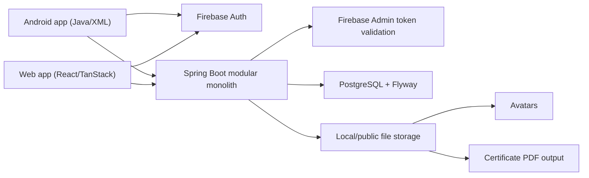

# EduLife Complete Application Workflows Code Map

## 1. Executive Summary

This report is a code-first inspection of the current EduLife repository on `2026-06-16`. It maps the workflows that actually exist in:

- `backend/`
- `app/`
- `guided-journey-lab/`
- `docs/`
- Flyway migrations
- backend tests

Workflow detail files:

- [01 Auth Workflows](workflows/01-auth-workflows.md)
- [02 Course Learning Workflows](workflows/02-course-learning-workflows.md)
- [03 Exam Certificate Workflows](workflows/03-exam-certificate-workflows.md)
- [04 Teacher Admin Group Workflows](workflows/04-teacher-admin-group-workflows.md)
- [05 Analytics Gamification AI Workflows](workflows/05-analytics-gamification-ai-workflows.md)
- [06 Web Workflows](workflows/06-web-workflows.md)

High-level counts from this inspection:

| Metric | Count | Notes |
| --- | ---: | --- |
| Major workflows mapped | 35 | Counts implemented, partial, backend-only, and documented gaps |
| End-to-end workflows that are largely working | 18 | Backend + at least one client surface |
| Partially implemented workflows | 11 | Usually backend exists but one client is missing or inconsistent |
| Broken or inconsistent workflows | 4 | Real code mismatch, not just backlog |
| Backend-only workflows | 4 | Endpoint exists without matching Android/Web coverage |
| Local-only / derived workflows | 3 | Planner and web level logic are not backend-driven |
| Documented but not implemented workflows | 3 | Notifications, discussions, public teacher profile |

Most stable implemented areas:

- Firebase token validation, auth sync, role resolution, and API hardening
- Learner flow from discovery through enrollment, lessons, progress, exams, and certificates
- Teacher request review, admin metrics, group management, analytics, and backend gamification

Highest-risk gaps:

1. The locked product rule says exam pass score is `80%`, but seeded/backend defaults are still `70%`.
2. Android login posts success even if `/api/v1/auth/sync` fails.
3. Web, Android, and backend do not agree on when the learner can start an exam.
4. Web has no account deletion flow even though backend and Android do.
5. CMS exam authoring exists on the backend but is not surfaced in Android or web.

## 2. Architecture Overview

EduLife is currently a three-surface product around one Spring Boot backend and one PostgreSQL schema.

Observed runtime model:

- Android and web both authenticate with Firebase and then send bearer tokens to the backend.
- `FirebaseTokenFilter` validates tokens, enforces `email_verified`, looks up the internal user, and loads RBAC from the database.
- `/api/v1/auth/sync` bridges Firebase identity to an internal UUID plus EduLife role.
- Core learning data lives in PostgreSQL tables created by Flyway migrations.
- Avatars and certificates use filesystem/public URL storage rather than BLOB storage.
- Gamification is backend-owned on Android, but the web `level` page still derives XP locally from other endpoints.

## 3. Endpoint Inventory

Legend:

- `Auth`: whether Firebase-authenticated access is required
- `Role`: extra RBAC gate beyond authentication
- `Status`: `Full`, `Partial`, `Backend only`, `Public`

| Method | Endpoint | Controller | Auth | Role | Workflow | Status |
| --- | --- | --- | --- | --- | --- | --- |
| `POST` | `/api/v1/auth/sync` | `AuthController` | Yes | Any verified user | Firebase identity bridge | Full |
| `DELETE` | `/api/v1/account` | `AccountController` | Yes | Owner | Delete/anonymize account | Full |
| `GET` | `/api/v1/profile` | `ProfileController` | Yes | Owner | Profile read | Full |
| `PUT` | `/api/v1/profile` | `ProfileController` | Yes | Owner | Profile update | Full |
| `POST` | `/api/v1/profile/avatar` | `ProfileController` | Yes | Owner | Avatar upload | Full |
| `GET` | `/api/v1/courses` | `CourseController` | Yes | Any verified user | Catalog/search/filter | Full |
| `GET` | `/api/v1/courses/{courseId}` | `CourseController` | Yes | Any verified user | Course detail | Full |
| `GET` | `/api/v1/courses/{courseId}/lessons/{lessonId}` | `LessonController` | Yes | Any verified user | Lesson detail / preview / enrolled access | Full |
| `POST` | `/api/v1/enrollments` | `EnrollmentController` | Yes | Learner path | Enroll | Full |
| `DELETE` | `/api/v1/enrollments/{id}` | `EnrollmentController` | Yes | Owner | Unenroll | Full |
| `GET` | `/api/v1/enrollments/me` | `EnrollmentController` | Yes | Owner | My courses | Full |
| `POST` | `/api/v1/courses/{courseId}/lessons/{lessonId}/complete` | `ProgressController` | Yes | Owner/enrolled unless preview | Mark lesson complete | Full |
| `GET` | `/api/v1/progress/courses/{courseId}` | `ProgressQueryController` | Yes | Owner + active enrollment | Course progress | Full |
| `GET` | `/api/v1/courses/{courseId}/exam` | `ExamController` | Yes | Owner + enrolled | Load questions | Partial |
| `GET` | `/api/v1/courses/{courseId}/exam/status` | `ExamController` | Yes | Owner + enrolled | Exam gating/cooldown status | Full |
| `POST` | `/api/v1/courses/{courseId}/exam/submit` | `ExamController` | Yes | Owner + enrolled | Submit answers / backend scoring | Full |
| `GET` | `/api/v1/certificates/me` | `CertificateController` | Yes | Owner | Certificate list | Full |
| `GET` | `/api/v1/certificates/{id}` | `CertificateController` | Yes | Owner | Certificate detail | Full |
| `GET` | `/api/v1/certificates/{id}/download` | `CertificateController` | Yes | Owner | Certificate PDF download | Full |
| `GET` | `/api/v1/certificates/verify/{verificationHash}` | `CertificateController` | No | Public | Certificate verification | Full |
| `POST` | `/api/v1/teacher-requests` | `TeacherRequestController` | Yes | Learner | Apply for teacher role | Full |
| `GET` | `/api/v1/teacher-requests/me` | `TeacherRequestController` | Yes | Owner | View latest teacher request | Full |
| `GET` | `/api/v1/admin/teacher-requests` | `AdminTeacherRequestController` | Yes | `ADMIN` | Review teacher requests | Full |
| `PUT` | `/api/v1/admin/teacher-requests/{id}/approve` | `AdminTeacherRequestController` | Yes | `ADMIN` | Approve teacher request | Full |
| `PUT` | `/api/v1/admin/teacher-requests/{id}/reject` | `AdminTeacherRequestController` | Yes | `ADMIN` | Reject teacher request | Full |
| `GET` | `/api/v1/admin/metrics` | `AdminMetricsController` | Yes | `ADMIN` | Admin dashboard metrics | Full |
| `GET` | `/api/v1/admin/users` | `AdminUserController` | Yes | `ADMIN` | User management list | Backend only |
| `PUT` | `/api/v1/admin/users/{id}/role` | `AdminUserController` | Yes | `ADMIN` | User role change | Backend only |
| `GET` | `/api/v1/cms/courses` | `CmsCourseController` | Yes | `TEACHER/GROUP_ADMIN/ADMIN` | Staff course list | Full |
| `POST` | `/api/v1/cms/courses` | `CmsCourseController` | Yes | `TEACHER/GROUP_ADMIN/ADMIN` | Create course draft | Full |
| `PUT` | `/api/v1/cms/courses/{id}` | `CmsCourseController` | Yes | Owner/staff scoped | Update course metadata | Partial |
| `PUT` | `/api/v1/cms/courses/{id}/publish` | `CmsCourseController` | Yes | `GROUP_ADMIN/ADMIN` | Publish approved course | Full |
| `PUT` | `/api/v1/cms/courses/{id}/archive` | `CmsCourseController` | Yes | `ADMIN` | Archive course | Backend only |
| `GET` | `/api/v1/cms/courses/{courseId}/sections` | `CmsSectionController` | Yes | Staff scoped | List sections | Full |
| `POST` | `/api/v1/cms/courses/{courseId}/sections` | `CmsSectionController` | Yes | Staff scoped | Create section | Full |
| `PUT` | `/api/v1/cms/courses/{courseId}/sections/{sectionId}` | `CmsSectionController` | Yes | Staff scoped | Update section | Backend only |
| `DELETE` | `/api/v1/cms/courses/{courseId}/sections/{sectionId}` | `CmsSectionController` | Yes | Staff scoped | Delete section | Full |
| `GET` | `/api/v1/cms/sections/{sectionId}/lessons` | `CmsLessonController` | Yes | Staff scoped | List lessons | Full |
| `POST` | `/api/v1/cms/sections/{sectionId}/lessons` | `CmsLessonController` | Yes | Staff scoped | Create lesson | Full |
| `PUT` | `/api/v1/cms/sections/{sectionId}/lessons/{lessonId}` | `CmsLessonController` | Yes | Staff scoped | Update lesson | Backend only |
| `DELETE` | `/api/v1/cms/sections/{sectionId}/lessons/{lessonId}` | `CmsLessonController` | Yes | Staff scoped | Delete lesson | Full |
| `GET` | `/api/v1/cms/courses/{courseId}/exam` | `CmsExamController` | Yes | Staff scoped | Read authored exam | Backend only |
| `POST` | `/api/v1/cms/courses/{courseId}/exam` | `CmsExamController` | Yes | Staff scoped | Create/update authored exam | Backend only |
| `GET` | `/api/v1/groups` | `GroupController` | Yes | `TEACHER/GROUP_ADMIN/ADMIN` | My groups | Full |
| `GET` | `/api/v1/groups/join-requests/mine` | `GroupController` | Yes | `TEACHER` | Teacher join request history | Backend only |
| `GET` | `/api/v1/groups/{groupId}` | `GroupController` | Yes | Owner/scoped | Group detail | Full |
| `POST` | `/api/v1/groups` | `GroupController` | Yes | `GROUP_ADMIN/ADMIN` | Create group | Full |
| `POST` | `/api/v1/groups/{groupId}/join-requests` | `GroupController` | Yes | `TEACHER` | Request to join group | Backend only |
| `GET` | `/api/v1/groups/{groupId}/join-requests` | `GroupController` | Yes | Owner/scoped | Review join queue | Backend only |
| `PUT` | `/api/v1/groups/{groupId}/join-requests/{requestId}/approve` | `GroupController` | Yes | Owner/scoped | Approve join request | Backend only |
| `PUT` | `/api/v1/groups/{groupId}/join-requests/{requestId}/reject` | `GroupController` | Yes | Owner/scoped | Reject join request | Backend only |
| `POST` | `/api/v1/groups/{groupId}/members` | `GroupController` | Yes | Owner/scoped | Add member by email | Full |
| `DELETE` | `/api/v1/groups/{groupId}/members/{userId}` | `GroupController` | Yes | Owner/scoped | Remove member | Full |
| `POST` | `/api/v1/groups/{groupId}/courses` | `GroupController` | Yes | Owner/scoped | Attach course to group | Full |
| `GET` | `/api/v1/analytics/me/summary` | `AnalyticsController` | Yes | Owner | Student analytics summary | Full |
| `GET` | `/api/v1/analytics/teacher/courses` | `AnalyticsController` | Yes | `TEACHER/ADMIN` | Teacher analytics summary | Full |
| `GET` | `/api/v1/analytics/platform` | `AnalyticsController` | Yes | `ADMIN` | Platform analytics summary | Full |
| `GET` | `/api/v1/analytics/me/progress-trend` | `CohortAnalyticsController` | Yes | Owner | Student trend analytics | Full |
| `GET` | `/api/v1/analytics/teacher/cohorts` | `CohortAnalyticsController` | Yes | `TEACHER/ADMIN` | Teacher cohort analytics | Full |
| `GET` | `/api/v1/analytics/group/{groupId}/cohorts` | `CohortAnalyticsController` | Yes | `GROUP_ADMIN/ADMIN` | Group cohort analytics | Full |
| `GET` | `/api/v1/analytics/platform/cohorts` | `CohortAnalyticsController` | Yes | `ADMIN` | Platform cohort analytics | Full |
| `GET` | `/api/v1/gamification/me` | `GamificationController` | Yes | Owner | Gamification state | Full |
| `GET` | `/api/v1/gamification/leaderboard` | `GamificationController` | Yes | Any verified user | Leaderboard | Full |
| `GET` | `/api/v1/gamification/badges` | `GamificationController` | Yes | Owner | Badge list | Full |
| `POST` | `/api/v1/advisor/recommend` | `AdvisorController` | Yes | Any verified user | AI/rule-based course recommendation | Partial |

## 4. Database / Migration Inventory

| Migration | Tables changed | Workflow supported | Notes |
| --- | --- | --- | --- |
| `V1__init.sql` | `users` | Identity/RBAC bridge | Internal UUID, Firebase UID, email, role |
| `V2__courses.sql` | `courses`, `course_sections`, `lessons` | Catalog, outline, lesson structure | Core discovery schema |
| `V3__seed_courses.sql` | seed rows | Demo catalog | Seeded published course data |
| `V4__enrollments.sql` | `enrollments` | Enroll/my courses | Active vs cancelled enrollment |
| `V5__course_image_url.sql` | `courses.image_url` | Course cards | Image support |
| `V6__lesson_content.sql` | `lessons.content_url`, `lessons.content_body` | Lesson player/resources | Supports article/video/resource payloads |
| `V7__progress.sql` | `lesson_progress`, `course_progress` | Lesson completion and course progress | Idempotent progress tracking |
| `V8__profiles.sql` | `profiles` | Profile/avatar | One profile per user |
| `V9__exams.sql` | `exams`, `exam_questions`, `exam_choices`, `exam_attempts` | MCQ exam flow | Seeded pass score still `70` |
| `V10__certificates.sql` | `certificates` | Certificate issuance | Unique per learner+course |
| `V11__groups.sql` | `groups`, `group_members`, `group_courses` | Group admin workflows | No detach-course table change later |
| `V12__account_anonymization.sql` | `users` | Delete account | Supports local anonymization |
| `V13__course_fts.sql` | `courses.search_vector` | Catalog search | PostgreSQL FTS for `q` |
| `V14__certificates_v2.sql` | `certificates` | Verify/download detail | Adds hash, issuer, PDF URL, attempt link |
| `V15__teacher_requests.sql` | `teacher_requests` | Teacher application flow | Pending/approved/rejected |
| `V16__add_role_constraint.sql` | `users` | RBAC integrity | Database role check |
| `V17__exam_attempt_passed_index.sql` | `exam_attempts` index | Exam status lookup | Faster passed/cooldown queries |
| `V18__seed_admin_user.sql` | seed rows | Admin access bootstrap | Environment setup |
| `V19__seed_staff_roles.sql` | seed rows | Dev/staff access bootstrap | Trusted email-role mapping |
| `V20__promote_admin_role.sql` | seed update | Admin bootstrap | Role correction migration |
| `V21__group_join_requests.sql` | `group_join_requests` | Teacher joins groups | Backend-only UI gap |
| `V22__gamification.sql` | `user_gamification_state`, `gamification_xp_events`, `user_badges` | XP/leaderboard/badges | Backend is source of truth |
| `V23__advisor_log.sql` | `advisor_log` | Advisor observability | Stores goal, JSON response, provider/model |
| `V24__certificate_dynamic_snapshots.sql` | `certificates` + seed instructor/profile updates | Historical certificate integrity | Snapshot fields preserve issued values |

## 5. Android Screen Inventory

| Screen / Fragment | ViewModel | Repository / API dependency | Workflow | Status |
| --- | --- | --- | --- | --- |
| `OnboardingFragment` | none/light state | local prefs | First-launch onboarding gate | Full |
| `LoginFragment` | `AuthViewModel` | Firebase Auth + `/auth/sync` | Login | Partial |
| `RegisterFragment` | `AuthViewModel` | Firebase Auth + `/auth/sync` | Register with role selection | Full |
| `HomeFragment` | course/enrollment/progress VMs | catalog + enrollments + progress + gamification | Learner dashboard | Full |
| `CoursesFragment` | `EnrollmentViewModel` | enrollments + course list | My courses / unenroll | Full |
| `CourseDetailFragment` | `CourseDetailViewModel` | course detail + progress | Course detail / exam CTA / lesson entry | Partial |
| `EnrollCourseFragment` | `EnrollmentViewModel` | enroll | Enrollment CTA | Full |
| `LessonPlayerFragment` | `LessonPlayerViewModel` | lesson detail + mark complete | Lesson consumption | Full |
| `ExamFragment` | `ExamViewModel` | exam/status/submit | Exam taking | Full |
| `ExamResultFragment` | none/light args | exam result args | Result display | Full |
| `CertificatesFragment` | `CertificateViewModel` | certificates list | My certificates | Full |
| `CertificateDetailFragment` | `CertificateDetailViewModel` | certificate detail + authenticated download | Certificate detail/PDF | Full |
| `ProfileFragment` | `ProfileViewModel`, `TeacherRequestViewModel` | profile + teacher requests + delete account | Profile hub | Full |
| `EditProfileFragment` | `ProfileViewModel` | update profile/avatar | Profile edit | Full |
| `TeacherRequestFragment` | `TeacherRequestViewModel` | teacher requests | Teacher application screen | Full |
| `TeacherDashboardFragment` | `TeacherDashboardViewModel` | CMS course endpoints | Teacher course list/create | Partial |
| `CmsCourseDetailFragment` | `CmsCourseDetailViewModel` | CMS sections/lessons | Teacher content editor | Partial |
| `AdminDashboardFragment` | `AdminViewModel` | admin metrics | Admin dashboard | Full |
| `TeacherRequestsFragment` | `AdminViewModel` | admin teacher requests | Admin moderation | Full |
| `GroupAdminDashboardFragment` | `GroupAdminDashboardViewModel` | groups | Group portal | Full |
| `GroupDetailFragment` | `GroupDetailViewModel` | group detail/member/course attach | Group detail | Partial |
| `CourseApprovalsFragment` | `CourseApprovalsViewModel` | CMS publish queue | Group course approvals | Full |
| `GamificationFragment` | `GamificationViewModel` | `/gamification/*` | XP, level, badges | Full |
| `StudentAnalyticsFragment` | `StudyAnalyticsViewModel` | analytics + enrollments + progress | Learner analytics | Full |
| `TeacherAnalyticsFragment` | `TeacherAnalyticsViewModel` | teacher analytics | Teacher analytics | Full |
| `PlatformAnalyticsFragment` | `PlatformAnalyticsViewModel` | platform analytics | Admin analytics | Full |
| `PlannerFragment` | `PlannerViewModel` | local storage + enrollments for labels | Planner | Local only |
| `AdvisorFragment` | `AdvisorViewModel` | advisor endpoint + enroll/catalog | AI advisor | Partial |

Important Android-only findings:

- `nav_graph.xml` routes `careerAdvisorFragment` to `com.baghdad.edulife.features.advisor.ui.AdvisorFragment`, while the older `features/courses/ui/CareerAdvisorFragment.java` still exists as dead/duplicate code.
- Forgot-password on Android is still a placeholder toast in `LoginFragment`.
- Admin user management CTA is a placeholder toast in `AdminDashboardFragment`.

## 6. Web Page Inventory

| Route | Main data/API calls | Workflow | Status |
| --- | --- | --- | --- |
| `/` | landing content | Marketing entry | Full |
| `/login` | Firebase sign-in + auth sync | Web login | Full |
| `/register` | Firebase sign-up + intended role | Web register | Full |
| `/forgot-password` | Firebase `sendPasswordResetEmail` | Password reset | Full |
| `/dashboard` | profile + enrollments + progress + courses | Learner dashboard / role redirect | Full |
| `/explore` | `listCourses`, `listMyEnrollments`, `enrollInCourse` | Catalog discovery | Full |
| `/courses` + `/courses/` | nested route shell | My courses area | Full |
| `/courses/$courseId` | `getCourseDetail`, `getCourseProgress` | Course detail | Partial |
| `/courses/$courseId/resources` | `getCourseDetail` | Resource grouping from lesson summaries | Partial |
| `/learn/$courseId/$lessonId` | lesson detail + progress + mark complete | Lesson consumption | Full |
| `/courses/$courseId/exam` | exam status + exam + submit | Web exam | Full |
| `/courses/$courseId/exam/result` | search params only | Exam result page | Full |
| `/certificates` + `/certificates/` | certificate shell/list | Web certificates | Full |
| `/certificates/$certificateId` | detail + download | Certificate detail/PDF | Full |
| `/certificates/verify/$hash` | public verify endpoint | Public verification | Full |
| `/profile` | `getProfile`, `updateProfile`, `uploadAvatar` | Web profile | Partial |
| `/planner` | localStorage + enrollments | Planner | Local only |
| `/level` | derived from profile/enrollments/progress/certs | Level page | Local/derived |
| `/advisor` | advisor endpoint + fallback matcher + enroll | Web advisor | Partial |
| `/analytics` | student/teacher/group analytics | Web analytics | Full |
| `/teach` + `/teach/` | CMS courses | Teaching studio | Partial |
| `/teach/$courseId` | sections + lessons CRUD | Course editor | Partial |
| `/approvals` | CMS courses + publish | Group course approvals | Full |
| `/groups` + `/groups/` | groups | Group portal | Full |
| `/groups/$groupId` | group detail + add/remove members + attach course | Group detail | Partial |
| `/admin` | layout guard | Admin portal shell | Full |
| `/admin/dashboard` | admin metrics + teacher requests | Admin dashboard | Full |
| `/admin/teacher-requests` | teacher request moderation | Admin moderation | Full |
| `/admin/analytics` | platform analytics | Admin analytics | Full |

Important web-only findings:

- There is no web account deletion UI or API client method.
- There is no web teacher-request submission/status page.
- There is no web admin user management page.
- There is no web CMS exam authoring route.
- The web `level` page does not use `/api/v1/gamification/*`; it recomputes XP locally.

## 7. Workflow Detail Files

Detailed workflow analysis lives in the split files listed at the top of this report. Each file follows the requested template with:

- role
- platform
- status
- entry point
- step-by-step flow
- backend code
- Android code
- web code
- database tables/migrations
- API contract
- security and ownership checks
- problems/missing pieces/recommended next fix

## 8. Workflow Coverage Matrix

| Workflow | Backend | Android | Web | DB | Tests | Status |
| --- | --- | --- | --- | --- | --- | --- |
| Register/login/logout | Yes | Yes | Yes | `users` | Partial | Partial |
| Password reset | No backend API, Firebase only | Placeholder | Yes | Firebase only | No repo tests | Partial |
| Auth sync | Yes | Yes | Yes | `users` | Yes | Full |
| Profile basics | Yes | Yes | Yes | `profiles` | Partial | Full |
| Avatar upload | Yes | Yes | Yes | `profiles` + storage | Yes | Full |
| Account deletion | Yes | Yes | No | `users/profiles` | Yes | Partial |
| Course discovery/detail | Yes | Yes | Yes | `courses/sections/lessons` | Yes | Full |
| Enrollment / My courses | Yes | Yes | Yes | `enrollments` | Yes | Full |
| Lesson access | Yes | Yes | Yes | `lessons` | Some | Full |
| Progress tracking | Yes | Yes | Yes | `lesson_progress/course_progress` | Yes | Full |
| Exam status/submit/result | Yes | Yes | Yes | `exams/exam_attempts` | Yes | Partial |
| Certificates | Yes | Yes | Yes | `certificates` | Yes | Full |
| Public certificate verify | Yes | No | Yes | `certificates` | Yes | Partial |
| Teacher request | Yes | Yes | No | `teacher_requests` | Some | Partial |
| Admin teacher moderation | Yes | Yes | Yes | `teacher_requests/users` | Some | Full |
| Teacher CMS metadata | Yes | Yes | Yes | `courses` | Some | Partial |
| Teacher CMS sections/lessons | Yes | Yes | Yes | `course_sections/lessons` | Some | Partial |
| Teacher CMS exam authoring | Yes | No | No | `exams/questions/choices` | No direct UI tests | Backend only |
| Admin user management | Yes | Placeholder | No | `users` | No direct tests | Backend only |
| Group management | Yes | Yes | Yes | `groups/members/courses` | Yes | Partial |
| Group join requests | Yes | No | No | `group_join_requests` | Some service/controller coverage | Backend only |
| Group course approvals | Yes | Yes | Yes | `courses` | Publish test | Full |
| Student analytics | Yes | Yes | Yes | derived queries | Yes | Full |
| Teacher analytics | Yes | Yes | Yes | derived queries | Yes | Full |
| Platform analytics | Yes | Yes | Yes | derived queries | Yes | Full |
| Group analytics | Yes | Android not found | Yes | derived queries | Yes | Partial |
| Gamification | Yes | Yes | Web not backend-driven | `user_gamification_state/xp_events/user_badges` | Yes | Partial |
| Study planner | No backend | Yes | Yes | local only | No | Local only |
| Career advisor | Yes | Yes | Yes | `advisor_log` | Yes | Partial |
| Public teacher profile | No | No | No | None | No | Not implemented |
| Notifications | No | No | No | None | No | Documented only |
| Discussions / Q&A | No | No | No | None | No | Documented only |

## 9. Critical Gaps

1. `AGENTS.md` locks pass score at `80%`, but `V9__exams.sql` seeds `70%`, and backend CMS comments still reference `70`.
2. `app/src/main/java/com/baghdad/edulife/features/auth/viewmodel/AuthViewModel.java` treats login as success even when backend sync fails.
3. Exam gating is inconsistent:
   - backend only requires enrollment
   - web hides the exam CTA until `progress.percentComplete >= 100`
   - Android shows the exam CTA for enrolled users without that gate
4. Web is missing the Play Store/compliance-adjacent delete-account flow that backend and Android already support.
5. Android is missing real forgot-password behavior.
6. CMS exam authoring is backend-only, so teachers cannot author/update exams from either client.
7. Admin user management is backend-only; Android exposes only a placeholder CTA and web has no route.
8. Group join requests are backend-only despite full backend endpoints and schema support.
9. Web `level` is not using backend gamification state and can drift from Android/backend truth.
10. Planner on both clients is local-only and not shared between devices or roles.
11. The backend test suite is currently red because `AuthSyncControllerTest.cleanDatabase` deletes the seeded instructor user now referenced by `courses.created_by_user_id` after `V24__certificate_dynamic_snapshots.sql`.

## 10. Recommended Implementation Order

1. Fix identity correctness first:
   - Android `AuthViewModel.login()` must fail closed when `/auth/sync` fails.
   - Decide and unify the pass score source of truth (`80%` vs `70%`).
2. Normalize learner exam rules:
   - choose one gating rule
   - enforce it consistently in backend, Android, and web
3. Close compliance and account-management gaps:
   - add web account deletion
   - add Android forgot-password
4. Finish missing staff tooling:
   - CMS exam authoring UI
   - admin user management UI
   - group join request UI
5. Remove duplicated/local-only divergence where possible:
   - migrate web `level` to backend gamification endpoints
   - decide whether planner stays intentionally local or gets backend persistence
6. Only after core parity:
   - consider public teacher profiles
   - then discussions/notifications if they are re-added to scope

## 11. Verification Commands

| Surface | Command | Result |
| --- | --- | --- |
| Backend | `.\mvnw.cmd test` | Failed. `225` tests ran with `10` errors, all from `AuthSyncControllerTest.cleanDatabase` due a seeded-instructor/course foreign-key conflict after `V24__certificate_dynamic_snapshots.sql`. |
| Android | `.\gradlew.bat :app:assembleDebug` | Passed |
| Web | `npm run build` | Passed with CSS optimizer warnings about Google Fonts `@import` ordering |
