# Rapport Academique - EduLife

## 1. Introduction generale

EduLife est une plateforme educative mobile-first concue pour structurer l'apprentissage des apprenants marocains. Le probleme vise est celui de la fragmentation de l'apprentissage: videos dispersees, groupes WhatsApp, PDF isoles, absence de progression claire et manque de certification verifiable. EduLife propose un parcours unique et coherent:

`Decouvrir un cours -> S'inscrire -> Suivre les lecons -> Passer l'examen final -> Reussir -> Recevoir un certificat`

Le projet est pense comme un MVP realiste. L'objectif n'est pas de construire immediatement une plateforme surdimensionnee, mais de valider d'abord le coeur du parcours apprenant avec une architecture solide, securisee et evolutive.

## 2. Idee et vision du projet

L'idee fondatrice d'EduLife est de transformer un apprentissage informel et chaotique en une experience guidee, mesurable et certifiante. La plateforme cible en priorite les apprenants marocains avec une logique mobile-first, un support multilingue progressif (Darija, francais, anglais) et une approche centree sur l'accessibilite.

La vision produit repose sur plusieurs principes:

- centraliser tout le parcours d'apprentissage dans un seul systeme;
- offrir une progression pedagogique structuree par cours, sections et lecons;
- proteger la valeur du certificat par un examen corrige cote serveur;
- permettre a plusieurs clients de consommer la meme logique metier: Android aujourd'hui, web aussi;
- garder une architecture simple pendant le MVP, puis l'etendre apres validation du noyau fonctionnel.

## 3. Methode de travail et strategie d'execution

La facon de travailler sur EduLife est volontairement pragmatique. Le projet suit une logique de sprints ordonnee autour du learner flow principal, avec une regle forte: ne pas disperser l'effort sur des fonctionnalites futures avant d'avoir valide le coeur du produit.

### 3.1 Approche de developpement

Le travail suit les principes suivants:

- backend-first par tranche verticale;
- integration Android des que les endpoints reels existent;
- reutilisation de seed data au lieu de mocks longs a maintenir;
- separation claire entre presentation, etat, acces reseau et logique metier;
- securite appliquee des la base via Firebase et Spring Security;
- documentation continue de chaque tache dans `docs/`.

### 3.2 Ordre reel du projet

L'execution suit l'ordre suivant:

1. fondation backend Spring Boot + PostgreSQL + Flyway;
2. pont d'identite Firebase avec `/api/v1/auth/sync`;
3. catalogue de cours;
4. inscription aux cours;
5. lecons et progression;
6. examens MCQ;
7. certificats;
8. durcissement, suppression de compte et controle qualite.

Cette discipline reduit le risque de construire des modules impressionnants mais non relies a la valeur principale du produit.

## 4. Architecture globale de la plateforme

EduLife est compose de quatre blocs principaux:

- un backend unifie Spring Boot;
- une application Android native Java/XML;
- une application web React/TanStack;
- Firebase pour l'authentification.

Le backend joue le role de source unique de verite pour les utilisateurs internes, les cours, les inscriptions, la progression, les examens et les certificats. Android et le web consomment les memes APIs REST securisees, avec le meme token Firebase en entree.

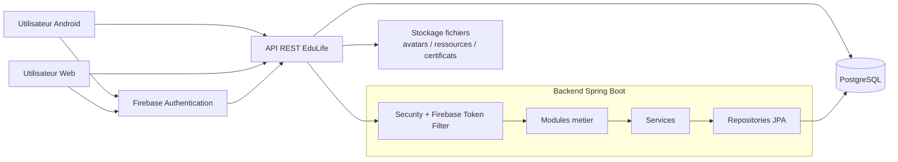

## 5. Architecture du backend

### 5.1 Choix architectural

Le backend adopte une architecture de **modular monolith**. Ce choix est particulierement adapte au MVP:

- un seul deployable simplifie l'hebergement;
- les modules restent clairement separes;
- la cohesion metier est preservee;
- la complexite des microservices est evitee;
- l'evolution future reste possible si un domaine doit etre extrait plus tard.

### 5.2 Technologies backend

Le backend utilise principalement:

- Java avec Spring Boot;
- Spring Web pour les APIs REST;
- Spring Security pour la protection des endpoints;
- Spring Data JPA pour l'acces aux donnees;
- PostgreSQL comme base relationnelle;
- Flyway pour les migrations et seed data;
- Firebase Admin SDK pour valider les tokens Firebase;
- Spring Validation pour les DTOs entrants;
- tests Spring Boot, Spring Security Test et Mockito.

### 5.3 Organisation modulaire

Le code backend est structure par domaines metier:

- `auth`
- `users`
- `profiles`
- `courses`
- `enrollments`
- `progress`
- `exams`
- `certificates`
- `groups`
- `admin`
- `account`
- `common`
- `security`
- `config`

Chaque module suit un schema clair:

- `controller/` pour l'exposition HTTP;
- `service/` pour la logique metier;
- `repository/` pour la persistence;
- `dto/` pour les contrats;
- `entity/` ou `model/` pour les structures internes.

### 5.4 Securite backend

Le backend impose une securite uniforme sur `/api/v1/**`.

Le flux de securite est le suivant:

1. Android ou le web obtient un token Firebase apres authentification.
2. Le client envoie `Authorization: Bearer <token>`.
3. `FirebaseTokenFilter` valide le token avec Firebase Admin SDK.
4. Le backend verifie notamment l'identite et l'etat de verification email.
5. Spring Security construit le contexte d'authentification.
6. Les services metier appliquent ensuite les regles d'acces et d'ownership.

Le backend contient aussi:

- un gestionnaire global d'erreurs `GlobalApiExceptionHandler`;
- un filtre de limitation de debit `RateLimitFilter` sur les endpoints sensibles;
- des controles de role pour l'administration et le CMS;
- des controles d'appartenance pour les inscriptions, la progression et les groupes.

### 5.5 Base de donnees et migrations

Le schema evolue via Flyway. Les migrations presentes couvrent deja:

- les utilisateurs et l'initialisation de base;
- les cours, sections et lecons;
- les seed data des cours;
- les inscriptions;
- l'URL d'image des cours;
- le contenu des lecons;
- la progression;
- les profils;
- les examens;
- les certificats;
- les groupes;
- l'anonymisation de compte;
- la recherche full-text de cours.

### 5.6 Modules metier principaux

#### Authentification et synchronisation

Le module `auth` ne gere pas le mot de passe lui-meme. La connexion primaire appartient a Firebase. Le backend se charge de synchroniser l'utilisateur vers un identifiant interne UUID via `/api/v1/auth/sync`.

#### Cours

Le module `courses` expose:

- la liste des cours publies;
- le detail d'un cours;
- les sections;
- les lecons;
- le detail d'une lecon.

#### Inscriptions

Le module `enrollments` gere:

- l'inscription a un cours;
- la desinscription;
- la consultation de `My Courses`.

#### Progression

Le module `progress` gere:

- le marquage d'une lecon comme terminee;
- le calcul de progression par cours;
- la lecture du detail de progression.

#### Examens

Le module `exams` suit la regle MVP:

- examen final MCQ;
- bonnes reponses conservees uniquement cote serveur;
- correction automatique cote serveur;
- seuil de reussite fixe a `80%`;
- politique de `2 echecs + 72h de cooldown`.

#### Certificats

Le module `certificates` expose la liste des certificats d'un utilisateur. Le certificat n'est delivre qu'apres validation de l'examen final.

#### Groupes et administration

Les modules `groups` et `admin` preparent la gouvernance de la plateforme:

- administration des utilisateurs et roles;
- groupes et membres;
- attachement cours-groupe;
- CMS de cours, sections, lecons et examens.

Cette partie existe deja, mais reste secondaire par rapport au coeur apprenant.

## 6. Architecture de l'application Android

### 6.1 Choix architectural

L'application Android suit une approche **Pragmatic MVVM** en Java/XML. Ce choix correspond bien au niveau actuel du produit:

- l'UI reste simple a controler;
- les `ViewModel` portent l'etat d'ecran;
- les `Repository` concentrent la communication API;
- l'introduction de couches trop abstraites est evitee.

### 6.2 Technologies Android

Le client Android utilise:

- Java;
- XML Layouts;
- AndroidX ViewModel;
- LiveData;
- Navigation Component;
- RecyclerView;
- Retrofit;
- Gson Converter;
- OkHttp Logging Interceptor;
- Firebase Authentication;
- Glide pour le chargement d'images;
- Material Components;
- SmoothBottomBar pour la navigation principale.

### 6.3 Structure de l'application

La structure suit les features:

- `core/network`
- `core/storage`
- `core/session`
- `features/auth`
- `features/onboarding`
- `features/courses`
- `features/profile`

Le pattern est coherent:

- `ui/` pour les fragments et adapters;
- `viewmodel/` pour l'etat et les actions;
- `data/` pour les repositories;
- `model/` pour les objets de transport d'etat et de reponse.

### 6.4 Ecrans principaux Android

Les ecrans visibles dans la navigation actuelle sont:

- onboarding;
- login;
- register;
- home;
- courses;
- profile;
- course detail;
- enroll course;
- lesson player.

### 6.5 Gestion de session Android

Android utilise une combinaison claire:

- `FirebaseAuthInterceptor` attache le token Bearer aux requetes;
- `FirebaseTokenAuthenticator` tente un refresh en cas de `401`;
- `SessionStorage` conserve l'identite interne utile localement;
- `SessionEventBus` signale l'expiration de session vers l'UI;
- `MainActivity` reconfigure le point d'entree selon onboarding et session.

Cette combinaison relie bien l'infrastructure reseau, la session locale et la navigation utilisateur.

## 7. Architecture de l'application web

### 7.1 Role du client web

La version web etend la portee d'EduLife au navigateur. Elle sert plusieurs objectifs:

- accessibilite sans installation;
- validation multi-plateforme du meme produit;
- vitrine produit avec landing page;
- experience de consultation et, a terme, de consommation de cours.

### 7.2 Technologies web

Le site web utilise:

- React 19;
- TypeScript;
- TanStack Start;
- TanStack Router;
- TanStack React Query;
- Tailwind CSS 4;
- composants Radix UI;
- Zod;
- React Hook Form;
- Framer Motion;
- Cloudflare Vite Plugin;
- deploiement cible sur Cloudflare Workers.

### 7.3 Organisation web

La structure web actuelle montre:

- des routes `index`, `login`, `register`, `dashboard`, `explore`, `courses`, `level`;
- des composants de landing page dans `src/components/landing`;
- des composants UI reutilisables dans `src/components/ui`.

### 7.4 Etat reel d'integration web

Il est important d'etre precis academiquement: la couche web est deja fortement avancee sur l'interface et l'architecture front-end, mais certaines pages utilisent encore des donnees de demonstration ou des TODO d'integration. Par exemple, les routes `login` et `register` indiquent encore un branchement a finaliser vers l'API.

Cela signifie que le web est un client architecte pour partager le meme backend, mais que son niveau d'integration fonctionnelle est aujourd'hui moins mature que celui d'Android sur le flux d'authentification et de cours.

## 8. Comment tout est connecte

L'interconnexion du systeme repose sur un principe simple: **un backend unique, plusieurs clients, une seule verite metier**.

### 8.1 Lien entre Firebase et le backend

Firebase authentifie l'utilisateur, mais ne remplace pas le modele de donnees metier du projet. Le backend valide le token et rattache la session a un utilisateur interne. Cette etape est necessaire pour:

- appliquer des roles metier propres a EduLife;
- proteger les ressources;
- eviter d'exposer directement le `firebase_uid`;
- centraliser les donnees dans PostgreSQL.

### 8.2 Lien entre backend et Android

Android consomme directement les endpoints REST avec Retrofit. Le token est injecte automatiquement par OkHttp, et l'UI observe les changements d'etat via `LiveData`.

### 8.3 Lien entre backend et web

Le web est concu pour utiliser les memes endpoints et la meme securite. TanStack Query doit gerer le cache de donnees serveur, tandis que Firebase fournit le token d'acces. Cela garantit une coherence complete lorsque l'integration est branchee bout en bout.

### 8.4 Lien entre logique metier et base de donnees

Les services Spring centralisent les regles metier, et les repositories JPA assurent la persistence transactionnelle. Les operations critiques comme l'inscription, la progression ou la soumission d'examen doivent rester atomiques.

## 9. Stack technologique synthese

| Couche | Technologies |
|---|---|
| Backend | Java, Spring Boot, Spring Web, Spring Security, Spring Data JPA, Flyway, PostgreSQL, Firebase Admin SDK |
| Android | Java, XML, ViewModel, LiveData, Retrofit, OkHttp, Navigation Component, Firebase Auth, Glide, Material Design |
| Web | React 19, TypeScript, TanStack Start, TanStack Router, TanStack Query, Tailwind CSS 4, Radix UI, Zod, React Hook Form, Framer Motion |
| Infrastructure | Firebase Authentication, Cloudflare Workers pour le web, PostgreSQL pour les donnees |
| Qualite | JUnit, Mockito, Spring Security Test, tests controleurs et services |

## 10. Cas d'utilisation

### 10.1 Acteurs

Les acteurs metier principaux sont:

- Etudiant;
- Enseignant;
- Group Admin;
- Platform Admin;
- Firebase Authentication;
- Systeme EduLife Backend.

### 10.2 Diagramme de cas d'utilisation

```mermaid
flowchart LR
    Student[Etudiant]
    Teacher[Enseignant]
    GroupAdmin[Group Admin]
    Admin[Platform Admin]

    UC1((S'inscrire / Se connecter))
    UC2((Synchroniser l'identite))
    UC3((Consulter le catalogue))
    UC4((Voir le detail d'un cours))
    UC5((S'inscrire a un cours))
    UC6((Suivre une lecon))
    UC7((Marquer une lecon terminee))
    UC8((Passer l'examen final))
    UC9((Consulter le resultat))
    UC10((Obtenir un certificat))
    UC11((Mettre a jour le profil))
    UC12((Supprimer le compte))
    UC13((Creer / modifier un cours))
    UC14((Gerer sections et lecons))
    UC15((Creer l'examen))
    UC16((Publier / archiver un cours))
    UC17((Gerer utilisateurs et roles))
    UC18((Gerer groupes et affectations))

    Student --> UC1
    Student --> UC2
    Student --> UC3
    Student --> UC4
    Student --> UC5
    Student --> UC6
    Student --> UC7
    Student --> UC8
    Student --> UC9
    Student --> UC10
    Student --> UC11
    Student --> UC12

    Teacher --> UC13
    Teacher --> UC14
    Teacher --> UC15

    Admin --> UC16
    Admin --> UC17
    Admin --> UC18

    GroupAdmin --> UC18
```

## 11. Diagramme de classes

Le diagramme suivant represente le noyau metier principal du MVP.

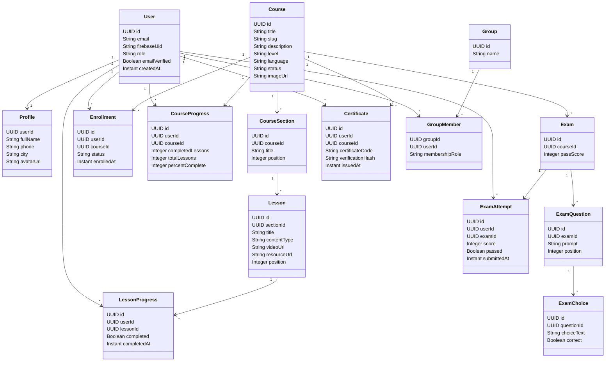

## 12. Diagrammes de sequence

### 12.1 Sequence 1 - Authentification et synchronisation utilisateur

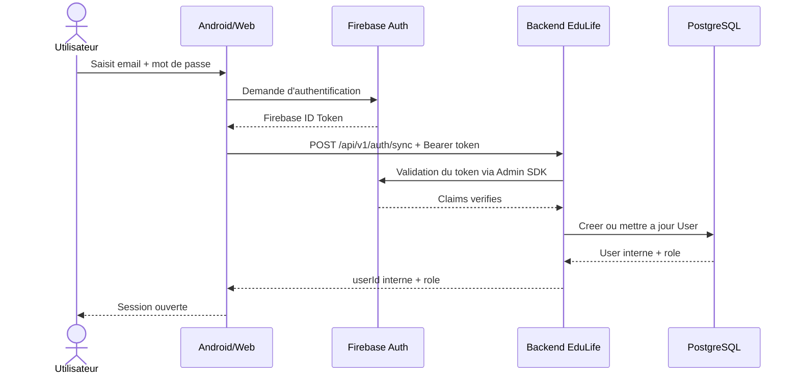

### 12.2 Sequence 2 - Consultation du catalogue de cours

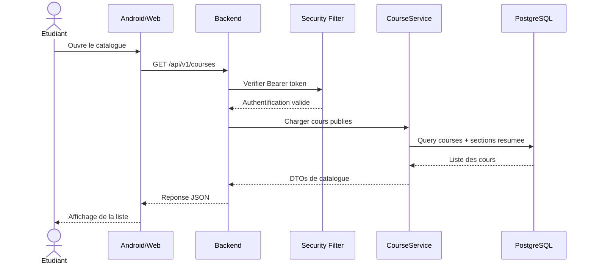

### 12.3 Sequence 3 - Inscription a un cours

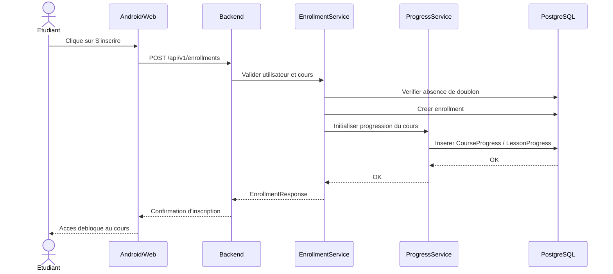

### 12.4 Sequence 4 - Completion d'une lecon et mise a jour de progression

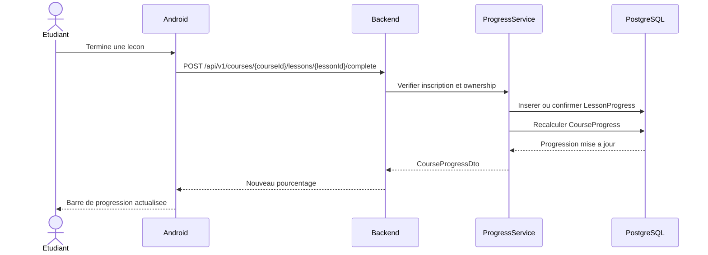

### 12.5 Sequence 5 - Soumission d'examen et emission du certificat

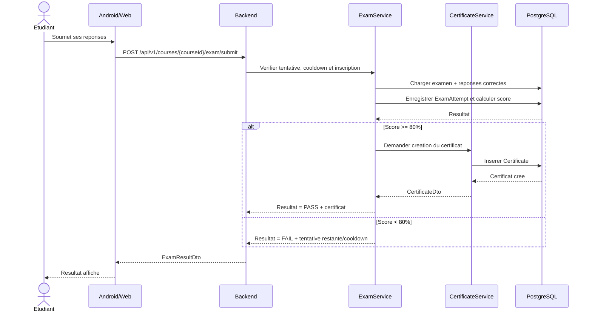

## 13. Diagrammes de workflow

### 13.1 Workflow global du parcours apprenant

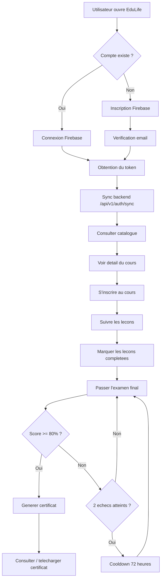

### 13.2 Workflow de securite d'une requete protegee

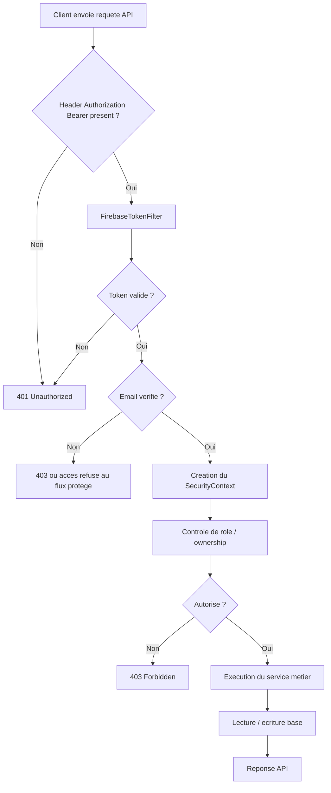

### 13.3 Workflow de creation et publication d'un cours

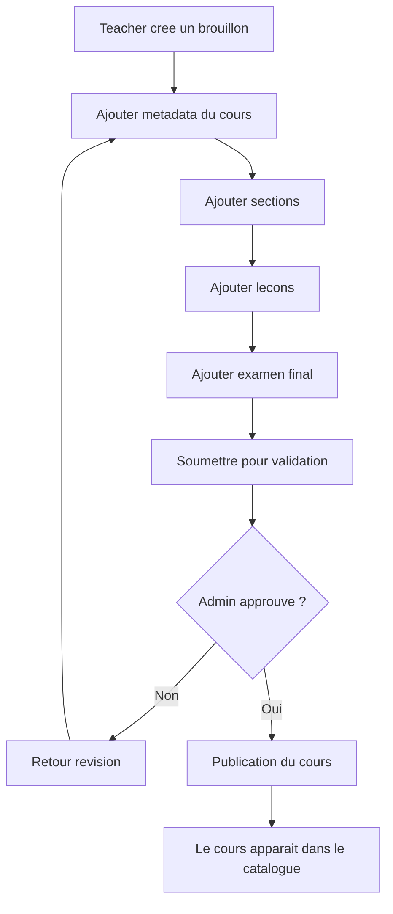

## 14. Analyse de coherence entre les couches

La force du projet vient de la coherence entre les couches:

- le backend impose les regles metier et la securite;
- Android fournit le client le plus avance fonctionnellement;
- le web etend l'accessibilite et partage la meme architecture logique;
- Firebase simplifie l'authentification sans deplacer les regles metier hors d'EduLife;
- PostgreSQL conserve la verite fonctionnelle du systeme.

Cette coherence evite plusieurs anti-patterns:

- logique d'examen cote client;
- duplication des regles entre Android et web;
- usage direct de Firebase comme seule base metier;
- creation prematuree de microservices.

## 15. Forces techniques du projet

Plusieurs choix renforcent la qualite de la solution:

- architecture modulaire claire;
- securite centralisee par filtre Firebase;
- persistence relationnelle coherente;
- progression des sprints alignee sur la valeur metier;
- reutilisation du backend entre Android et web;
- documentation continue de l'evolution du projet;
- tests backend deja presents sur les modules critiques.

## 16. Limites actuelles et points a finaliser

Le projet reste un MVP en cours d'evolution. Les principales limites actuelles sont:

- l'integration web n'est pas encore entierement branchee sur les endpoints reels;
- certaines fonctions avancees sont volontairement differees;
- la partie CMS existe mais ne doit pas detourner l'effort du learner flow;
- la generation et la distribution de certificats doivent continuer a etre stabilisees avec la logique d'examen;
- des verifications de bout en bout restent necessaires apres chaque sprint majeur.

Ces limites ne sont pas des faiblesses structurelles; elles sont la consequence normale d'une strategie de livraison progressive.

## 17. Conclusion

EduLife est un projet de plateforme educative coherent, ancre dans un besoin reel: structurer l'apprentissage pour les apprenants marocains autour d'un parcours guide, securise et certifiant. Le projet se distingue par un choix architectural mature pour un MVP: un backend monolithique modulaire, une application Android native en MVVM pragmatique, une application web moderne React/TanStack, et une authentification centralisee via Firebase.

L'ensemble forme un systeme multi-client unifie, ou Android et le web peuvent partager la meme logique metier, les memes donnees et les memes garanties de securite. La valeur du projet ne vient pas seulement de son interface, mais de la rigueur du parcours pedagogique et de la coherence technique entre toutes les couches.

Dans une perspective academique et professionnelle, EduLife constitue un exemple realiste de conception d'une plateforme numerique moderne: architecture propre, priorisation juste, vision claire et evolution progressive a partir d'un coeur metier bien defini.
