# EduLife — Mermaid Sequence Diagrams Extracted from Workflow Docs

## 01 — Auth Workflows

### 1. App Entry, Session Routing, and Role Portals

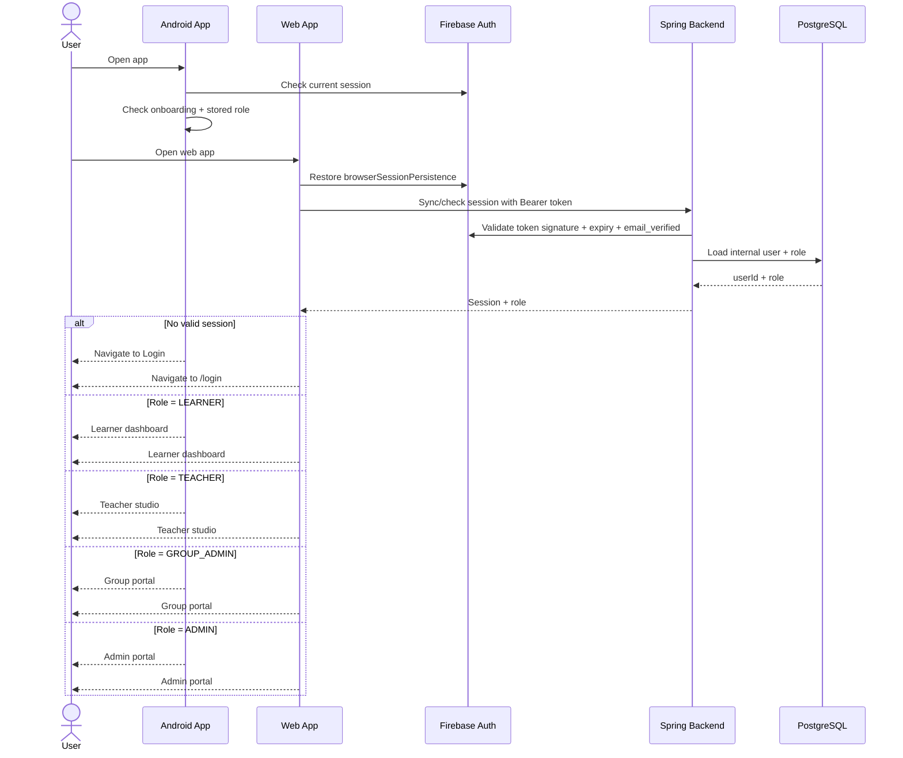
```mermaid
sequenceDiagram
    actor User
    participant Android as Android App
    participant Web as Web App
    participant Firebase as Firebase Auth
    participant Backend as Spring Backend
    participant DB as PostgreSQL

    User->>Android: Open app
    Android->>Firebase: Check current session
    Android->>Android: Check onboarding + stored role

    User->>Web: Open web app
    Web->>Firebase: Restore browserSessionPersistence
    Web->>Backend: Sync/check session with Bearer token
    Backend->>Firebase: Validate token signature + expiry + email_verified
    Backend->>DB: Load internal user + role
    DB-->>Backend: userId + role
    Backend-->>Web: Session + role

    alt No valid session
        Android-->>User: Navigate to Login
        Web-->>User: Navigate to /login
    else Role = LEARNER
        Android-->>User: Learner dashboard
        Web-->>User: Learner dashboard
    else Role = TEACHER
        Android-->>User: Teacher studio
        Web-->>User: Teacher studio
    else Role = GROUP_ADMIN
        Android-->>User: Group portal
        Web-->>User: Group portal
    else Role = ADMIN
        Android-->>User: Admin portal
        Web-->>User: Admin portal
    end
```

### 2. Register and Login

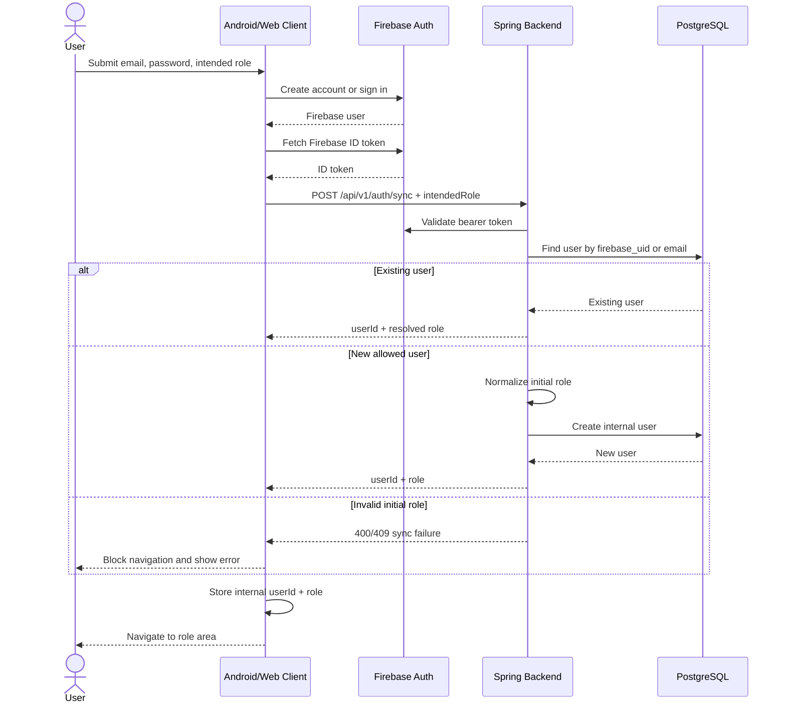
```mermaid
sequenceDiagram
    actor User
    participant Client as Android/Web Client
    participant Firebase as Firebase Auth
    participant Backend as Spring Backend
    participant DB as PostgreSQL

    User->>Client: Submit email, password, intended role
    Client->>Firebase: Create account or sign in
    Firebase-->>Client: Firebase user
    Client->>Firebase: Fetch Firebase ID token
    Firebase-->>Client: ID token
    Client->>Backend: POST /api/v1/auth/sync + intendedRole
    Backend->>Firebase: Validate bearer token
    Backend->>DB: Find user by firebase_uid or email

    alt Existing user
        DB-->>Backend: Existing user
        Backend-->>Client: userId + resolved role
    else New allowed user
        Backend->>Backend: Normalize initial role
        Backend->>DB: Create internal user
        DB-->>Backend: New user
        Backend-->>Client: userId + role
    else Invalid initial role
        Backend-->>Client: 400/409 sync failure
        Client-->>User: Block navigation and show error
    end

    Client->>Client: Store internal userId + role
    Client-->>User: Navigate to role area
```

### 3. Password Reset

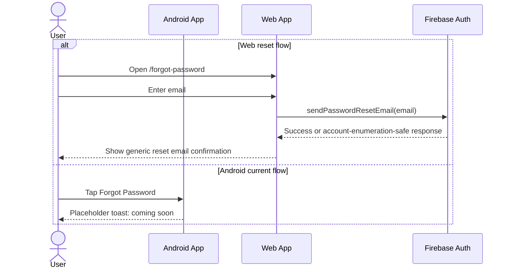
```mermaid
sequenceDiagram
    actor User
    participant Android as Android App
    participant Web as Web App
    participant Firebase as Firebase Auth

    alt Web reset flow
        User->>Web: Open /forgot-password
        User->>Web: Enter email
        Web->>Firebase: sendPasswordResetEmail(email)
        Firebase-->>Web: Success or account-enumeration-safe response
        Web-->>User: Show generic reset email confirmation
    else Android current flow
        User->>Android: Tap Forgot Password
        Android-->>User: Placeholder toast: coming soon
    end
```

### 4. Firebase Auth Sync

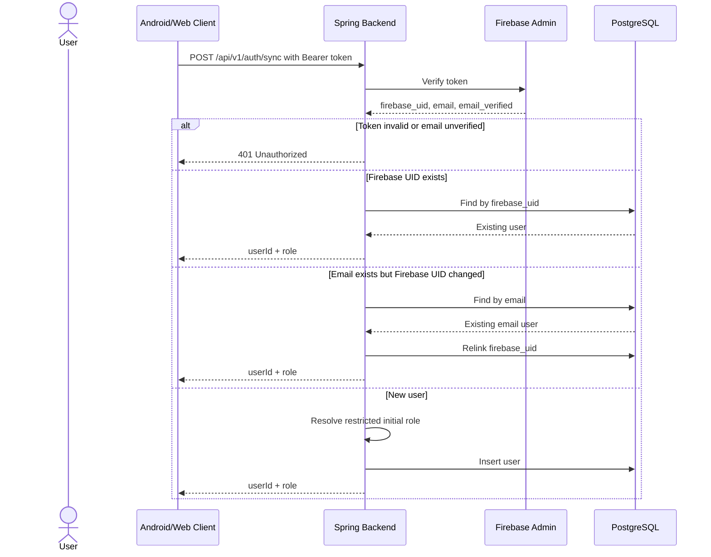
```mermaid
sequenceDiagram
    actor User
    participant Client as Android/Web Client
    participant Backend as Spring Backend
    participant Firebase as Firebase Admin
    participant DB as PostgreSQL

    Client->>Backend: POST /api/v1/auth/sync with Bearer token
    Backend->>Firebase: Verify token
    Firebase-->>Backend: firebase_uid, email, email_verified

    alt Token invalid or email unverified
        Backend-->>Client: 401 Unauthorized
    else Firebase UID exists
        Backend->>DB: Find by firebase_uid
        DB-->>Backend: Existing user
        Backend-->>Client: userId + role
    else Email exists but Firebase UID changed
        Backend->>DB: Find by email
        DB-->>Backend: Existing email user
        Backend->>DB: Relink firebase_uid
        Backend-->>Client: userId + role
    else New user
        Backend->>Backend: Resolve restricted initial role
        Backend->>DB: Insert user
        Backend-->>Client: userId + role
    end
```

### 5. Profile, Avatar, and Account Deletion

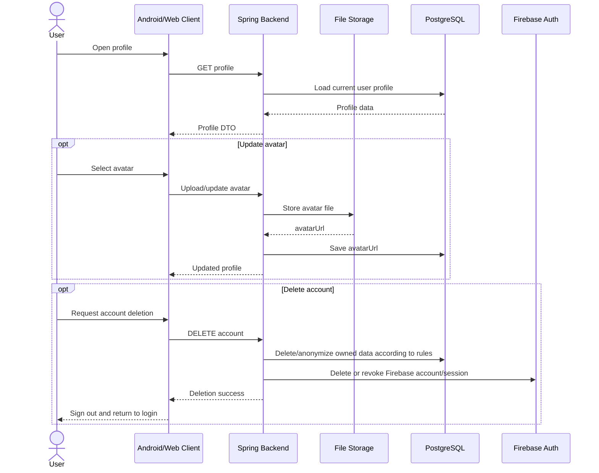
```mermaid
sequenceDiagram
    actor User
    participant Client as Android/Web Client
    participant Backend as Spring Backend
    participant Storage as File Storage
    participant DB as PostgreSQL
    participant Firebase as Firebase Auth

    User->>Client: Open profile
    Client->>Backend: GET profile
    Backend->>DB: Load current user profile
    DB-->>Backend: Profile data
    Backend-->>Client: Profile DTO

    opt Update avatar
        User->>Client: Select avatar
        Client->>Backend: Upload/update avatar
        Backend->>Storage: Store avatar file
        Storage-->>Backend: avatarUrl
        Backend->>DB: Save avatarUrl
        Backend-->>Client: Updated profile
    end

    opt Delete account
        User->>Client: Request account deletion
        Client->>Backend: DELETE account
        Backend->>DB: Delete/anonymize owned data according to rules
        Backend->>Firebase: Delete or revoke Firebase account/session
        Backend-->>Client: Deletion success
        Client-->>User: Sign out and return to login
    end
```

## 02 — Course and Learning Workflows

### 6. Course Discovery and Catalog Search

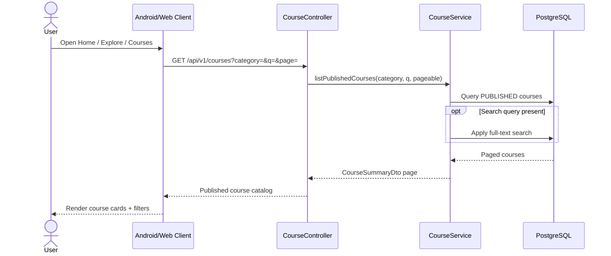
```mermaid
sequenceDiagram
    actor User
    participant Client as Android/Web Client
    participant Backend as CourseController
    participant Service as CourseService
    participant DB as PostgreSQL

    User->>Client: Open Home / Explore / Courses
    Client->>Backend: GET /api/v1/courses?category=&q=&page=
    Backend->>Service: listPublishedCourses(category, q, pageable)
    Service->>DB: Query PUBLISHED courses
    opt Search query present
        Service->>DB: Apply full-text search
    end
    DB-->>Service: Paged courses
    Service-->>Backend: CourseSummaryDto page
    Backend-->>Client: Published course catalog
    Client-->>User: Render course cards + filters
```

### 7. Course Detail and Resource Viewing

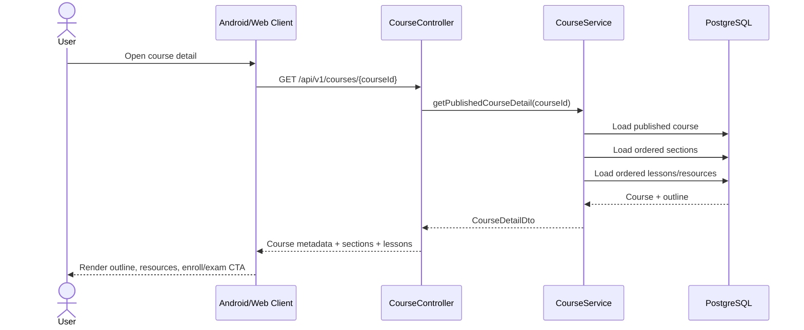
```mermaid
sequenceDiagram
    actor User
    participant Client as Android/Web Client
    participant Backend as CourseController
    participant Service as CourseService
    participant DB as PostgreSQL

    User->>Client: Open course detail
    Client->>Backend: GET /api/v1/courses/{courseId}
    Backend->>Service: getPublishedCourseDetail(courseId)
    Service->>DB: Load published course
    Service->>DB: Load ordered sections
    Service->>DB: Load ordered lessons/resources
    DB-->>Service: Course + outline
    Service-->>Backend: CourseDetailDto
    Backend-->>Client: Course metadata + sections + lessons
    Client-->>User: Render outline, resources, enroll/exam CTA
```

### 8. Enrollment and My Courses

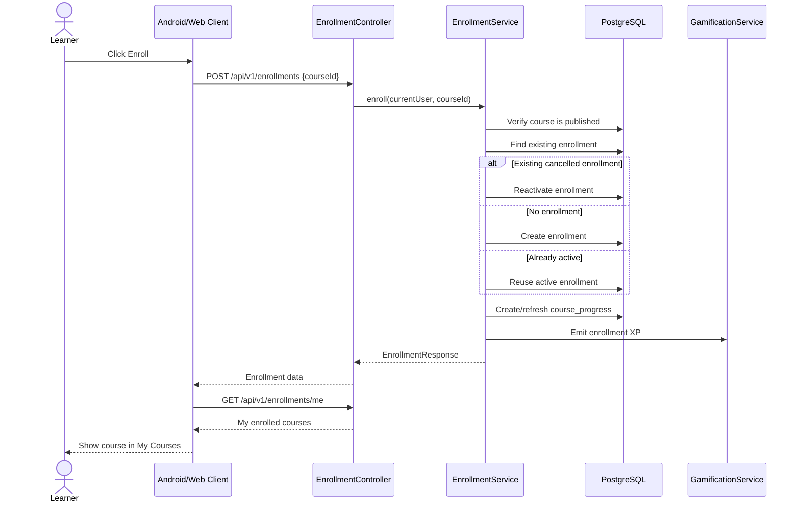
```mermaid
sequenceDiagram
    actor Learner
    participant Client as Android/Web Client
    participant Backend as EnrollmentController
    participant Service as EnrollmentService
    participant DB as PostgreSQL
    participant Game as GamificationService

    Learner->>Client: Click Enroll
    Client->>Backend: POST /api/v1/enrollments {courseId}
    Backend->>Service: enroll(currentUser, courseId)
    Service->>DB: Verify course is published
    Service->>DB: Find existing enrollment

    alt Existing cancelled enrollment
        Service->>DB: Reactivate enrollment
    else No enrollment
        Service->>DB: Create enrollment
    else Already active
        Service->>DB: Reuse active enrollment
    end

    Service->>DB: Create/refresh course_progress
    Service->>Game: Emit enrollment XP
    Service-->>Backend: EnrollmentResponse
    Backend-->>Client: Enrollment data
    Client->>Backend: GET /api/v1/enrollments/me
    Backend-->>Client: My enrolled courses
    Client-->>Learner: Show course in My Courses
```

### 9. Lesson Access

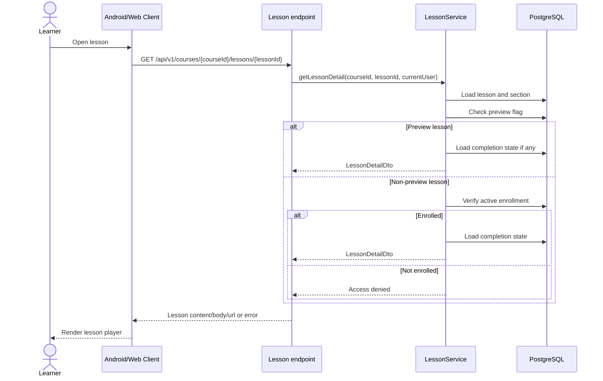
```mermaid
sequenceDiagram
    actor Learner
    participant Client as Android/Web Client
    participant Backend as Lesson endpoint
    participant Service as LessonService
    participant DB as PostgreSQL

    Learner->>Client: Open lesson
    Client->>Backend: GET /api/v1/courses/{courseId}/lessons/{lessonId}
    Backend->>Service: getLessonDetail(courseId, lessonId, currentUser)
    Service->>DB: Load lesson and section
    Service->>DB: Check preview flag

    alt Preview lesson
        Service->>DB: Load completion state if any
        Service-->>Backend: LessonDetailDto
    else Non-preview lesson
        Service->>DB: Verify active enrollment
        alt Enrolled
            Service->>DB: Load completion state
            Service-->>Backend: LessonDetailDto
        else Not enrolled
            Service-->>Backend: Access denied
        end
    end

    Backend-->>Client: Lesson content/body/url or error
    Client-->>Learner: Render lesson player
```

### 10. Lesson Completion and Course Progress

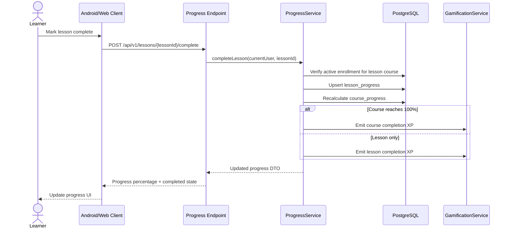
```mermaid
sequenceDiagram
    actor Learner
    participant Client as Android/Web Client
    participant Backend as Progress Endpoint
    participant Service as ProgressService
    participant DB as PostgreSQL
    participant Game as GamificationService

    Learner->>Client: Mark lesson complete
    Client->>Backend: POST /api/v1/lessons/{lessonId}/complete
    Backend->>Service: completeLesson(currentUser, lessonId)
    Service->>DB: Verify active enrollment for lesson course
    Service->>DB: Upsert lesson_progress
    Service->>DB: Recalculate course_progress

    alt Course reaches 100%
        Service->>Game: Emit course completion XP
    else Lesson only
        Service->>Game: Emit lesson completion XP
    end

    Service-->>Backend: Updated progress DTO
    Backend-->>Client: Progress percentage + completed state
    Client-->>Learner: Update progress UI
```

## 03 — Exam and Certificate Workflows

### 11. Exam Availability and Status

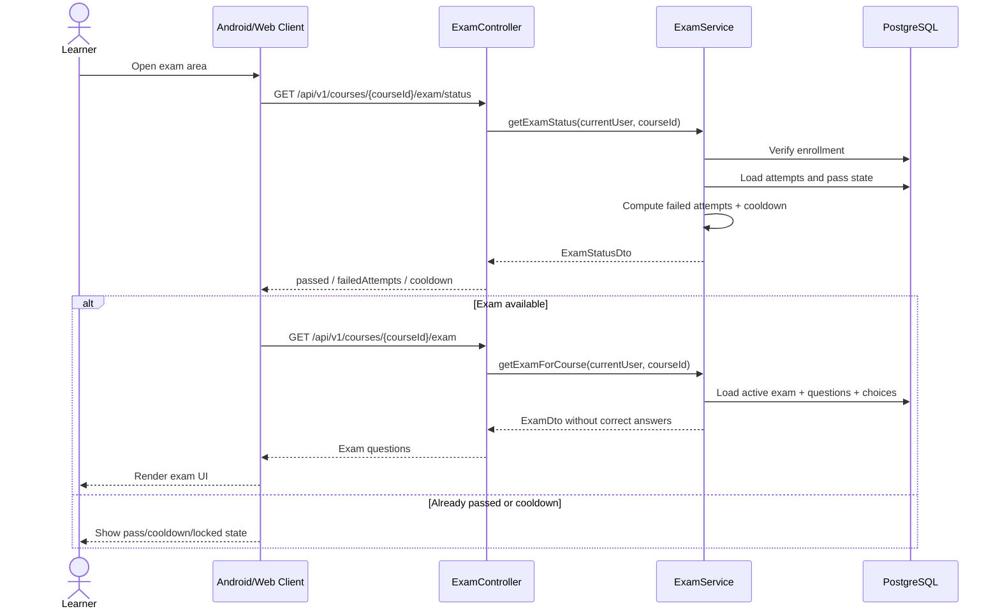
```mermaid
sequenceDiagram
    actor Learner
    participant Client as Android/Web Client
    participant Backend as ExamController
    participant Service as ExamService
    participant DB as PostgreSQL

    Learner->>Client: Open exam area
    Client->>Backend: GET /api/v1/courses/{courseId}/exam/status
    Backend->>Service: getExamStatus(currentUser, courseId)
    Service->>DB: Verify enrollment
    Service->>DB: Load attempts and pass state
    Service->>Service: Compute failed attempts + cooldown
    Service-->>Backend: ExamStatusDto
    Backend-->>Client: passed / failedAttempts / cooldown

    alt Exam available
        Client->>Backend: GET /api/v1/courses/{courseId}/exam
        Backend->>Service: getExamForCourse(currentUser, courseId)
        Service->>DB: Load active exam + questions + choices
        Service-->>Backend: ExamDto without correct answers
        Backend-->>Client: Exam questions
        Client-->>Learner: Render exam UI
    else Already passed or cooldown
        Client-->>Learner: Show pass/cooldown/locked state
    end
```

### 12. Exam Submission, Backend Scoring, Result, and Cooldown

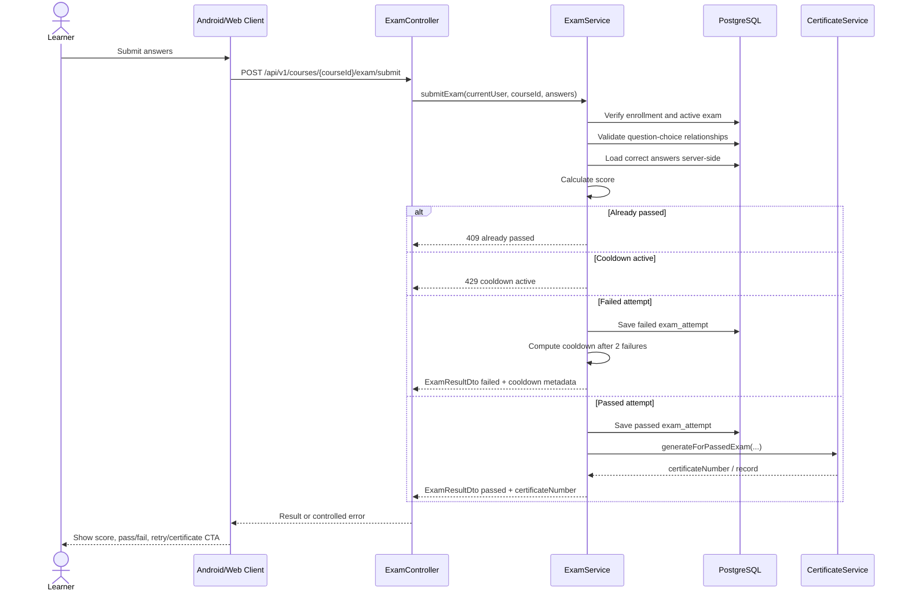
```mermaid
sequenceDiagram
    actor Learner
    participant Client as Android/Web Client
    participant Backend as ExamController
    participant Service as ExamService
    participant DB as PostgreSQL
    participant Cert as CertificateService

    Learner->>Client: Submit answers
    Client->>Backend: POST /api/v1/courses/{courseId}/exam/submit
    Backend->>Service: submitExam(currentUser, courseId, answers)
    Service->>DB: Verify enrollment and active exam
    Service->>DB: Validate question-choice relationships
    Service->>DB: Load correct answers server-side
    Service->>Service: Calculate score

    alt Already passed
        Service-->>Backend: 409 already passed
    else Cooldown active
        Service-->>Backend: 429 cooldown active
    else Failed attempt
        Service->>DB: Save failed exam_attempt
        Service->>Service: Compute cooldown after 2 failures
        Service-->>Backend: ExamResultDto failed + cooldown metadata
    else Passed attempt
        Service->>DB: Save passed exam_attempt
        Service->>Cert: generateForPassedExam(...)
        Cert-->>Service: certificateNumber / record
        Service-->>Backend: ExamResultDto passed + certificateNumber
    end

    Backend-->>Client: Result or controlled error
    Client-->>Learner: Show score, pass/fail, retry/certificate CTA
```

### 13. Certificate Generation, Listing, Detail, and PDF Download

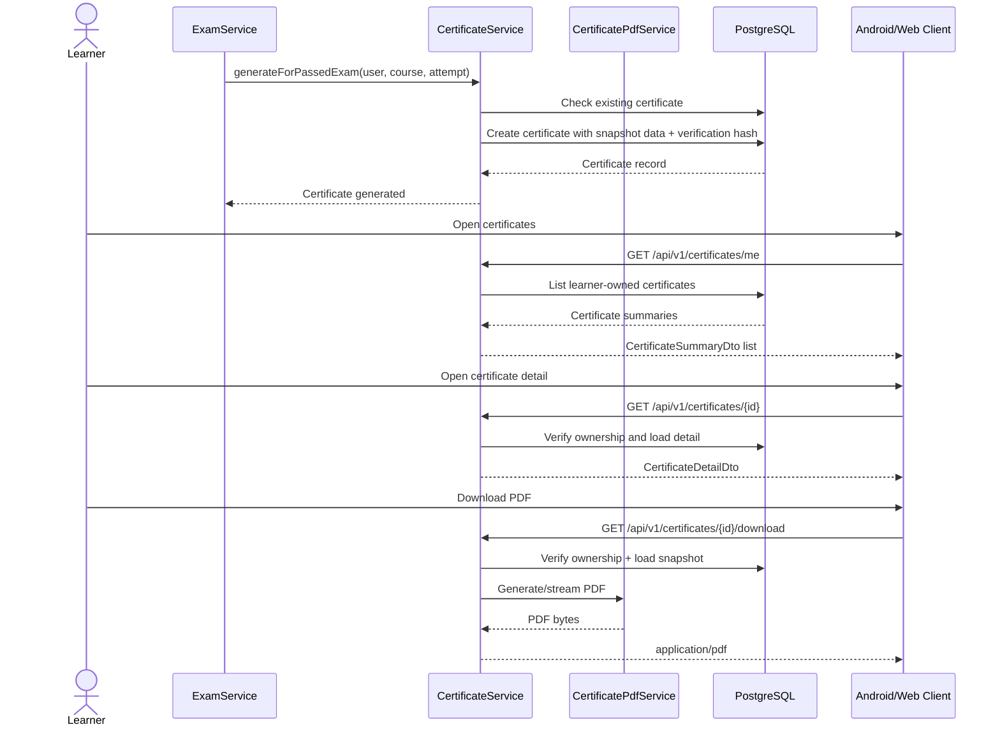
```mermaid
sequenceDiagram
    actor Learner
    participant Exam as ExamService
    participant Cert as CertificateService
    participant Pdf as CertificatePdfService
    participant DB as PostgreSQL
    participant Client as Android/Web Client

    Exam->>Cert: generateForPassedExam(user, course, attempt)
    Cert->>DB: Check existing certificate
    Cert->>DB: Create certificate with snapshot data + verification hash
    DB-->>Cert: Certificate record
    Cert-->>Exam: Certificate generated

    Learner->>Client: Open certificates
    Client->>Cert: GET /api/v1/certificates/me
    Cert->>DB: List learner-owned certificates
    DB-->>Cert: Certificate summaries
    Cert-->>Client: CertificateSummaryDto list

    Learner->>Client: Open certificate detail
    Client->>Cert: GET /api/v1/certificates/{id}
    Cert->>DB: Verify ownership and load detail
    Cert-->>Client: CertificateDetailDto

    Learner->>Client: Download PDF
    Client->>Cert: GET /api/v1/certificates/{id}/download
    Cert->>DB: Verify ownership + load snapshot
    Cert->>Pdf: Generate/stream PDF
    Pdf-->>Cert: PDF bytes
    Cert-->>Client: application/pdf
```

### 14. Public Certificate Verification

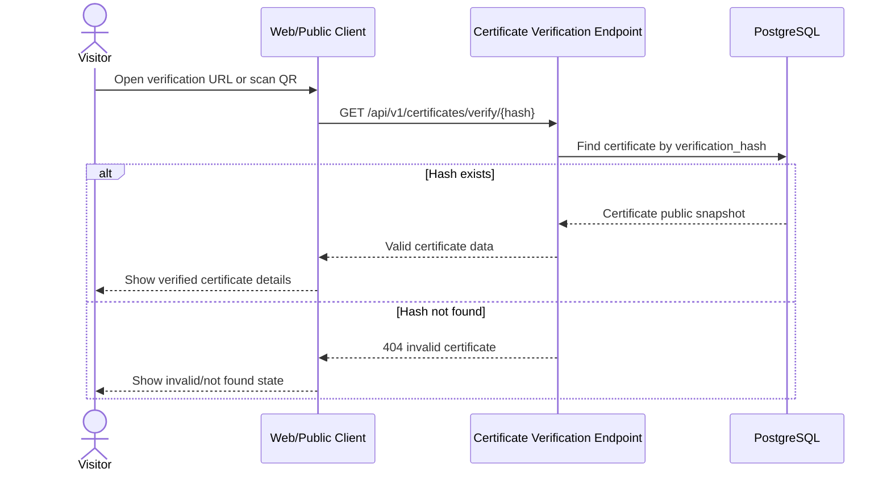
```mermaid
sequenceDiagram
    actor Visitor
    participant Client as Web/Public Client
    participant Backend as Certificate Verification Endpoint
    participant DB as PostgreSQL

    Visitor->>Client: Open verification URL or scan QR
    Client->>Backend: GET /api/v1/certificates/verify/{hash}
    Backend->>DB: Find certificate by verification_hash

    alt Hash exists
        DB-->>Backend: Certificate public snapshot
        Backend-->>Client: Valid certificate data
        Client-->>Visitor: Show verified certificate details
    else Hash not found
        Backend-->>Client: 404 invalid certificate
        Client-->>Visitor: Show invalid/not found state
    end
```

## 04 — Teacher, Admin, and Group Workflows

### 15. Teacher Request Submission and Status

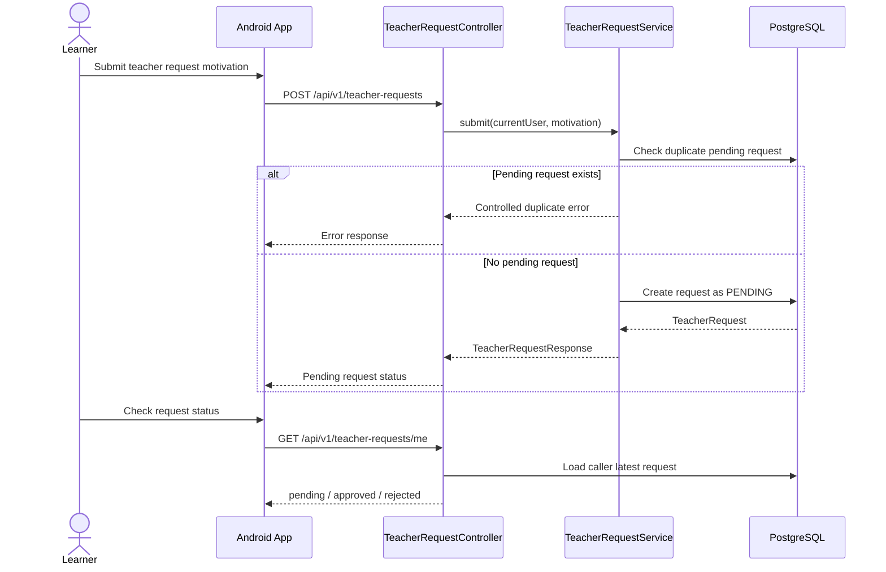
```mermaid
sequenceDiagram
    actor Learner
    participant Android as Android App
    participant Backend as TeacherRequestController
    participant Service as TeacherRequestService
    participant DB as PostgreSQL

    Learner->>Android: Submit teacher request motivation
    Android->>Backend: POST /api/v1/teacher-requests
    Backend->>Service: submit(currentUser, motivation)
    Service->>DB: Check duplicate pending request

    alt Pending request exists
        Service-->>Backend: Controlled duplicate error
        Backend-->>Android: Error response
    else No pending request
        Service->>DB: Create request as PENDING
        DB-->>Service: TeacherRequest
        Service-->>Backend: TeacherRequestResponse
        Backend-->>Android: Pending request status
    end

    Learner->>Android: Check request status
    Android->>Backend: GET /api/v1/teacher-requests/me
    Backend->>DB: Load caller latest request
    Backend-->>Android: pending / approved / rejected
```

### 16. Admin Teacher Request Moderation

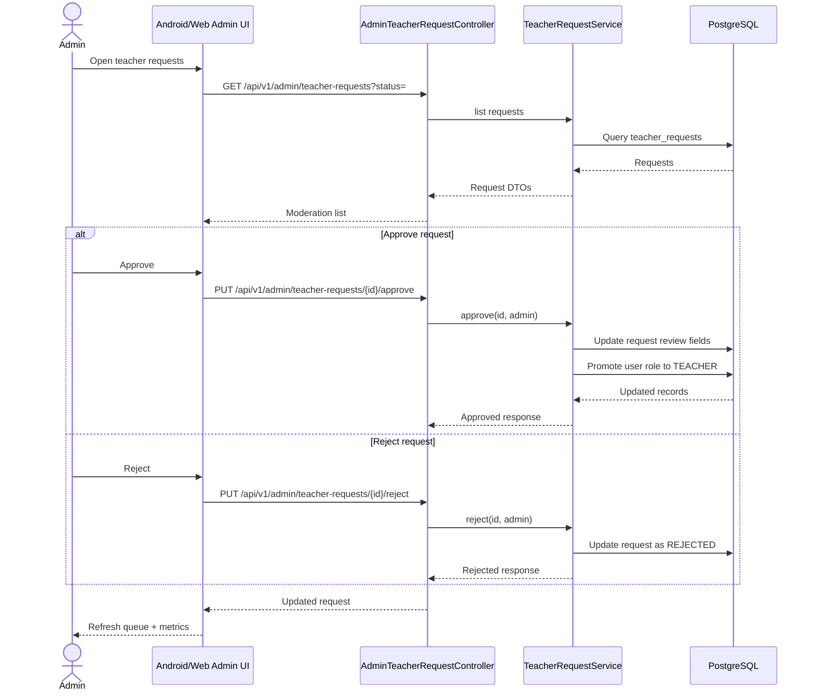
```mermaid
sequenceDiagram
    actor Admin
    participant Client as Android/Web Admin UI
    participant Backend as AdminTeacherRequestController
    participant Service as TeacherRequestService
    participant DB as PostgreSQL

    Admin->>Client: Open teacher requests
    Client->>Backend: GET /api/v1/admin/teacher-requests?status=
    Backend->>Service: list requests
    Service->>DB: Query teacher_requests
    DB-->>Service: Requests
    Service-->>Backend: Request DTOs
    Backend-->>Client: Moderation list

    alt Approve request
        Admin->>Client: Approve
        Client->>Backend: PUT /api/v1/admin/teacher-requests/{id}/approve
        Backend->>Service: approve(id, admin)
        Service->>DB: Update request review fields
        Service->>DB: Promote user role to TEACHER
        DB-->>Service: Updated records
        Service-->>Backend: Approved response
    else Reject request
        Admin->>Client: Reject
        Client->>Backend: PUT /api/v1/admin/teacher-requests/{id}/reject
        Backend->>Service: reject(id, admin)
        Service->>DB: Update request as REJECTED
        Service-->>Backend: Rejected response
    end

    Backend-->>Client: Updated request
    Client-->>Admin: Refresh queue + metrics
```

### 17. Teacher CMS Course, Section, and Lesson Management

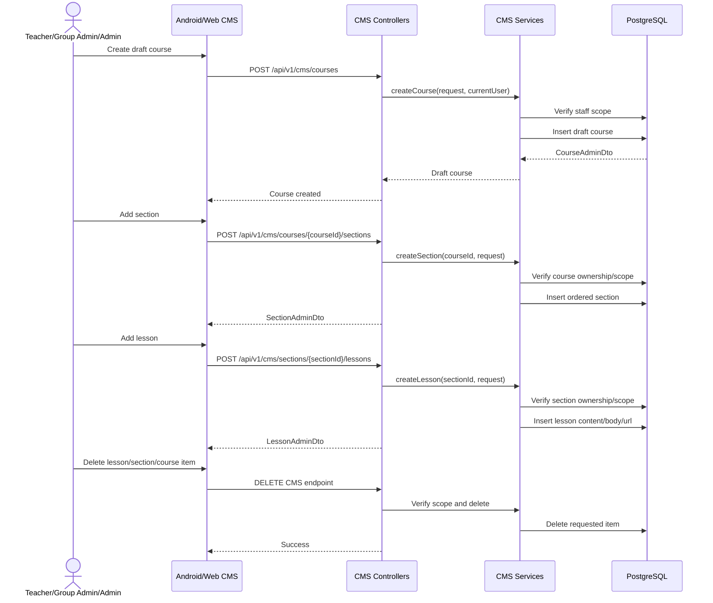
```mermaid
sequenceDiagram
    actor Staff as Teacher/Group Admin/Admin
    participant Client as Android/Web CMS
    participant Backend as CMS Controllers
    participant Service as CMS Services
    participant DB as PostgreSQL

    Staff->>Client: Create draft course
    Client->>Backend: POST /api/v1/cms/courses
    Backend->>Service: createCourse(request, currentUser)
    Service->>DB: Verify staff scope
    Service->>DB: Insert draft course
    DB-->>Service: CourseAdminDto
    Service-->>Backend: Draft course
    Backend-->>Client: Course created

    Staff->>Client: Add section
    Client->>Backend: POST /api/v1/cms/courses/{courseId}/sections
    Backend->>Service: createSection(courseId, request)
    Service->>DB: Verify course ownership/scope
    Service->>DB: Insert ordered section
    Backend-->>Client: SectionAdminDto

    Staff->>Client: Add lesson
    Client->>Backend: POST /api/v1/cms/sections/{sectionId}/lessons
    Backend->>Service: createLesson(sectionId, request)
    Service->>DB: Verify section ownership/scope
    Service->>DB: Insert lesson content/body/url
    Backend-->>Client: LessonAdminDto

    Staff->>Client: Delete lesson/section/course item
    Client->>Backend: DELETE CMS endpoint
    Backend->>Service: Verify scope and delete
    Service->>DB: Delete requested item
    Backend-->>Client: Success
```

### 18. Teacher Exam Authoring

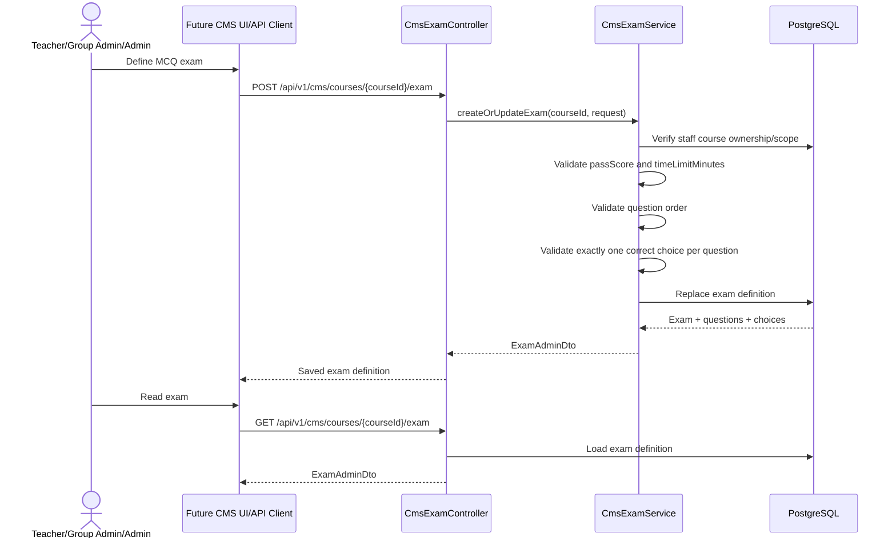
```mermaid
sequenceDiagram
    actor Staff as Teacher/Group Admin/Admin
    participant Client as Future CMS UI/API Client
    participant Backend as CmsExamController
    participant Service as CmsExamService
    participant DB as PostgreSQL

    Staff->>Client: Define MCQ exam
    Client->>Backend: POST /api/v1/cms/courses/{courseId}/exam
    Backend->>Service: createOrUpdateExam(courseId, request)
    Service->>DB: Verify staff course ownership/scope
    Service->>Service: Validate passScore and timeLimitMinutes
    Service->>Service: Validate question order
    Service->>Service: Validate exactly one correct choice per question
    Service->>DB: Replace exam definition
    DB-->>Service: Exam + questions + choices
    Service-->>Backend: ExamAdminDto
    Backend-->>Client: Saved exam definition

    Staff->>Client: Read exam
    Client->>Backend: GET /api/v1/cms/courses/{courseId}/exam
    Backend->>DB: Load exam definition
    Backend-->>Client: ExamAdminDto
```

### 19. Admin Dashboard and Platform Metrics

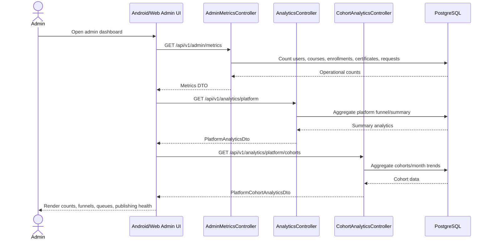
```mermaid
sequenceDiagram
    actor Admin
    participant Client as Android/Web Admin UI
    participant Metrics as AdminMetricsController
    participant Analytics as AnalyticsController
    participant Cohorts as CohortAnalyticsController
    participant DB as PostgreSQL

    Admin->>Client: Open admin dashboard
    Client->>Metrics: GET /api/v1/admin/metrics
    Metrics->>DB: Count users, courses, enrollments, certificates, requests
    DB-->>Metrics: Operational counts
    Metrics-->>Client: Metrics DTO

    Client->>Analytics: GET /api/v1/analytics/platform
    Analytics->>DB: Aggregate platform funnel/summary
    DB-->>Analytics: Summary analytics
    Analytics-->>Client: PlatformAnalyticsDto

    Client->>Cohorts: GET /api/v1/analytics/platform/cohorts
    Cohorts->>DB: Aggregate cohorts/month trends
    DB-->>Cohorts: Cohort data
    Cohorts-->>Client: PlatformCohortAnalyticsDto

    Client-->>Admin: Render counts, funnels, queues, publishing health
```

### 20. Admin User Management

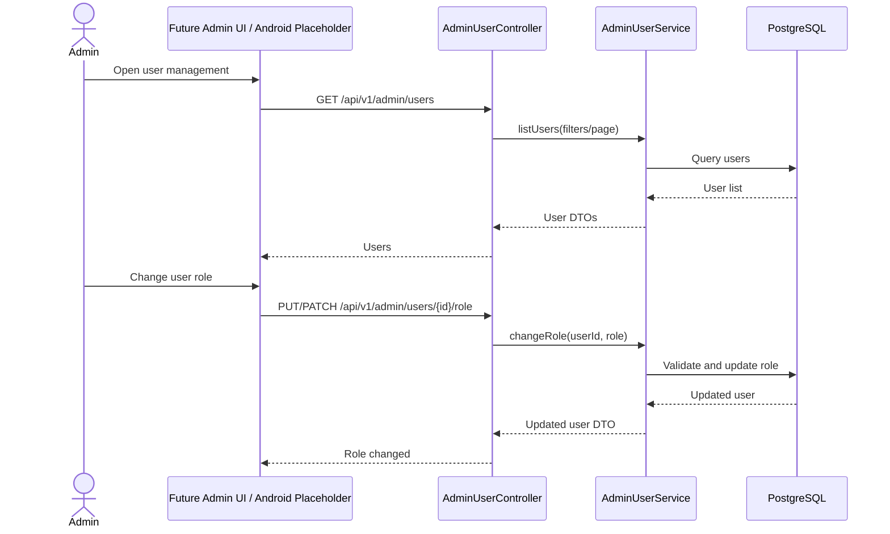
```mermaid
sequenceDiagram
    actor Admin
    participant Client as Future Admin UI / Android Placeholder
    participant Backend as AdminUserController
    participant Service as AdminUserService
    participant DB as PostgreSQL

    Admin->>Client: Open user management
    Client->>Backend: GET /api/v1/admin/users
    Backend->>Service: listUsers(filters/page)
    Service->>DB: Query users
    DB-->>Service: User list
    Service-->>Backend: User DTOs
    Backend-->>Client: Users

    Admin->>Client: Change user role
    Client->>Backend: PUT/PATCH /api/v1/admin/users/{id}/role
    Backend->>Service: changeRole(userId, role)
    Service->>DB: Validate and update role
    DB-->>Service: Updated user
    Service-->>Backend: Updated user DTO
    Backend-->>Client: Role changed
```

### 21. Group Management and Course Approvals

```mermaid
sequenceDiagram
    actor GroupAdmin as Group Admin
    actor Admin
    participant Client as Web/Android Staff UI
    participant Backend as Group/Admin Controllers
    participant Service as Group/Course Approval Services
    participant DB as PostgreSQL

    GroupAdmin->>Client: Open group portal
    Client->>Backend: GET /api/v1/groups or owned group detail
    Backend->>Service: Load owned groups
    Service->>DB: Query groups + members + courses
    DB-->>Service: Group data
    Service-->>Backend: Group DTOs
    Backend-->>Client: Group portal data

    GroupAdmin->>Client: Add/manage teachers
    Client->>Backend: Group member endpoint
    Backend->>Service: Verify group ownership
    Service->>DB: Add/update group member
    Backend-->>Client: Updated membership

    GroupAdmin->>Client: Approve/publish managed course
    Client->>Backend: Approval endpoint
    Backend->>Service: Verify course belongs to managed teacher/group
    Service->>DB: Publish or reject course draft
    Backend-->>Client: Approval result

    Admin->>Client: Global approvals
    Client->>Backend: Admin approval endpoint
    Backend->>Service: Platform-wide approval
    Service->>DB: Publish/reject any eligible course
    Backend-->>Client: Admin approval result
```

### 22. Group Join Requests

```mermaid
sequenceDiagram
    actor Teacher
    actor GroupAdmin as Group Admin
    participant Client as Web/API Client
    participant Backend as Group Join Request Controller
    participant Service as GroupJoinRequestService
    participant DB as PostgreSQL

    Teacher->>Client: Request to join group
    Client->>Backend: POST group join request
    Backend->>Service: submitJoinRequest(teacher, group)
    Service->>DB: Check duplicate pending request
    Service->>DB: Create PENDING group join request
    Backend-->>Client: Request submitted

    GroupAdmin->>Client: Review group join requests
    Client->>Backend: GET group join requests
    Backend->>Service: List requests for owned group
    Service->>DB: Query pending requests
    Backend-->>Client: Request list

    alt Approve
        GroupAdmin->>Client: Approve teacher
        Client->>Backend: Approve request
        Backend->>Service: Verify group admin owns group
        Service->>DB: Mark approved + create group membership
        Backend-->>Client: Approved
    else Reject
        GroupAdmin->>Client: Reject teacher
        Client->>Backend: Reject request
        Service->>DB: Mark rejected
        Backend-->>Client: Rejected
    end
```

## 05 — Analytics, Gamification, and AI Workflows

### 23. Student, Teacher, Group, and Platform Analytics

```mermaid
sequenceDiagram
    actor User as Learner/Teacher/Group Admin/Admin
    participant Client as Android/Web Client
    participant Backend as Analytics Controllers
    participant Service as AnalyticsService
    participant DB as PostgreSQL

    User->>Client: Open analytics page

    alt Learner self analytics
        Client->>Backend: GET /api/v1/analytics/me/summary and progress-trend
        Backend->>Service: Build learner summary from current user
        Service->>DB: Aggregate enrollments, lessons, attempts, passes, certificates
    else Teacher analytics
        Client->>Backend: GET /api/v1/analytics/teacher/courses or cohorts
        Backend->>Service: Verify TEACHER role
        Service->>DB: Aggregate owned-course performance by created_by_user_id
    else Group analytics
        Client->>Backend: GET /api/v1/analytics/group/{groupId}/cohorts
        Backend->>Service: Verify owned group authorization
        Service->>DB: Aggregate group cohorts
    else Platform analytics
        Client->>Backend: GET /api/v1/analytics/platform and cohorts
        Backend->>Service: Verify ADMIN role
        Service->>DB: Aggregate global funnel and month trends
    end

    DB-->>Service: Analytics rows
    Service-->>Backend: Scoped analytics DTO
    Backend-->>Client: Analytics response
    Client-->>User: Render charts/cards
```

### 24. Backend Gamification State, Leaderboard, and Badges

```mermaid
sequenceDiagram
    actor Learner
    participant Learning as Learning/Exam/Certificate Services
    participant Game as GamificationService
    participant DB as PostgreSQL
    participant Android as Android Gamification UI

    Learning->>Game: Emit XP event for enrollment/lesson/course/exam/certificate/daily login
    Game->>DB: Insert XP event with dedup_key

    alt Duplicate event
        DB-->>Game: Dedup prevents double award
    else New event
        Game->>DB: Update user_gamification_state
        Game->>DB: Award badges if thresholds reached
    end

    Learner->>Android: Open gamification screen
    Android->>Game: GET /api/v1/gamification/me
    Game->>DB: Load level, XP, streak, badges
    Game-->>Android: GamificationStateDto

    Android->>Game: GET /api/v1/gamification/leaderboard
    Game->>DB: Load ranked users
    Game-->>Android: LeaderboardEntryDto list

    Android->>Game: GET /api/v1/gamification/badges
    Game->>DB: Load earned/available badges
    Game-->>Android: BadgeDto list
    Android-->>Learner: Render level, streak, badges, leaderboard
```

### 25. Web Level Progress Page

```mermaid
sequenceDiagram
    actor Learner
    participant Web as Web /level Route
    participant Backend as Existing Backend APIs
    participant Local as Browser Runtime

    Learner->>Web: Open /level
    Web->>Backend: Load profile
    Web->>Backend: Load enrollments
    Web->>Backend: Load progress
    Web->>Backend: Load certificates
    Backend-->>Web: Data sets
    Web->>Local: Derive XP, levels, badges, streaks locally
    Local-->>Web: Derived progress model
    Web-->>Learner: Render level/progress dashboard

    note over Web,Backend: Does not currently use /api/v1/gamification/*, so it can drift from backend truth.
```

### 26. Study Planner

```mermaid
sequenceDiagram
    actor Learner
    participant Client as Android/Web Planner
    participant Local as SharedPreferences/localStorage
    participant Backend as Optional Enrollment APIs

    Learner->>Client: Open planner
    Client->>Local: Load goals, tasks, study days, hours
    opt Show focus courses
        Client->>Backend: Load current enrollments
        Backend-->>Client: Enrolled courses
    end
    Local-->>Client: Saved planner state
    Client-->>Learner: Render planner

    Learner->>Client: Add task / toggle day / log hours
    Client->>Local: Save updated planner state locally
    Client-->>Learner: Update planner UI

    note over Client,Local: No backend persistence or cross-device sync currently.
```

### 27. Career Advisor / AI Advisor

```mermaid
sequenceDiagram
    actor Learner
    participant Client as Android/Web Advisor
    participant Backend as AdvisorController
    participant Advisor as Advisor Service
    participant DB as PostgreSQL
    participant Local as Web Local Fallback

    Learner->>Client: Enter career/learning goal
    Client->>Backend: POST /api/v1/advisor/recommend {goal}
    Backend->>Advisor: recommend(goal, currentUser)
    Advisor->>DB: Load catalog and learner context/enrollments

    alt Backend recommendation succeeds
        DB-->>Advisor: Courses + context
        Advisor->>Advisor: Match goal to recommended courses + reasoning
        Advisor-->>Backend: Recommendation DTO
        Backend-->>Client: Recommended courses + explanation
    else Backend/AI unavailable on web
        Client->>Local: Run local matcher fallback
        Local-->>Client: Local recommended courses
    end

    Client-->>Learner: Show recommendations and reasoning
```

### 28. Public Teacher Profile, Notifications, and Discussions

```mermaid
sequenceDiagram
    actor User
    participant Client as Android/Web Client
    participant Backend as Profile/Notification/Discussion APIs
    participant DB as PostgreSQL

    opt Public teacher profile
        User->>Client: Open teacher profile
        Client->>Backend: GET public teacher profile
        Backend->>DB: Load teacher identity, courses, public stats
        DB-->>Backend: Profile snapshot
        Backend-->>Client: Public teacher DTO
        Client-->>User: Render teacher profile
    end

    opt Notifications
        User->>Client: Open notifications
        Client->>Backend: GET notifications
        Backend->>DB: Load user-scoped notifications
        DB-->>Backend: Notification list
        Backend-->>Client: Notifications
        Client-->>User: Render notification center
    end

    opt Course discussions
        User->>Client: Open course discussion
        Client->>Backend: GET discussion threads/messages
        Backend->>DB: Verify course access and load messages
        DB-->>Backend: Threads/messages
        Backend-->>Client: Discussion data
        User->>Client: Post message/reply
        Client->>Backend: POST discussion message
        Backend->>DB: Save message and notify participants
        Backend-->>Client: Saved message
    end
```

## 06 — Web Workflows

### 29. Web Authentication and Session Lifecycle

```mermaid
sequenceDiagram
    actor User
    participant Web as Web App
    participant Firebase as Firebase Auth
    participant Backend as Spring Backend
    participant DB as PostgreSQL

    User->>Web: Login or register
    Web->>Firebase: Sign in / create account
    Firebase-->>Web: Firebase user
    Web->>Web: Store intended role in localStorage for first sync
    Web->>Firebase: Observe auth state changes
    Web->>Backend: POST /api/v1/auth/sync with ID token
    Backend->>Firebase: Verify token
    Backend->>DB: Upsert/load internal user role
    DB-->>Backend: userId + role
    Backend-->>Web: Session model

    alt No session
        Web-->>User: Redirect to /login
    else Learner
        Web-->>User: Redirect to learner dashboard
    else Teacher
        Web-->>User: Redirect to /teach
    else Group Admin
        Web-->>User: Redirect to /groups
    else Admin
        Web-->>User: Redirect to /admin/dashboard
    end

    opt Forgot password
        User->>Web: Submit email on /forgot-password
        Web->>Firebase: sendPasswordResetEmail
        Web-->>User: Generic confirmation
    end
```

### 30. Web Learner Study Experience

```mermaid
sequenceDiagram
    actor Learner
    participant Web as Web Learner Routes
    participant Backend as Spring Backend
    participant DB as PostgreSQL

    Learner->>Web: Open /dashboard
    Web->>Backend: Load profile, enrollments, progress, suggestions
    Backend->>DB: Query learner state
    Backend-->>Web: Dashboard data

    Learner->>Web: Open /explore
    Web->>Backend: GET /api/v1/courses
    Backend-->>Web: Catalog

    Learner->>Web: Enroll in course
    Web->>Backend: POST /api/v1/enrollments
    Backend->>DB: Create/reactivate enrollment + progress
    Backend-->>Web: Enrollment response

    Learner->>Web: Study lesson
    Web->>Backend: GET /api/v1/courses/{courseId}/lessons/{lessonId}
    Backend-->>Web: Lesson detail
    Web->>Backend: POST lesson complete
    Backend->>DB: Update progress
    Backend-->>Web: Updated progress

    Learner->>Web: Take exam
    Web->>Backend: GET exam status then questions
    Backend-->>Web: Exam status/questions
    Web->>Backend: POST exam submit
    Backend->>DB: Save attempt and maybe certificate
    Backend-->>Web: Result

    Learner->>Web: Open certificates
    Web->>Backend: GET certificates list/detail/download/verify
    Backend-->>Web: Certificate data or PDF
```

### 31. Web Staff Portals

```mermaid
sequenceDiagram
    actor Staff as Teacher/Group Admin/Admin
    participant Web as Web Staff Routes
    participant Backend as Spring Backend
    participant DB as PostgreSQL

    Staff->>Web: Open staff route
    Web->>Web: Apply role guard

    alt Teacher studio
        Web->>Backend: GET/POST /api/v1/cms/courses
        Backend->>DB: List/create owned courses
        Web->>Backend: Manage sections and lessons
        Backend->>DB: CRUD sections/lessons
    else Group portal
        Web->>Backend: GET /groups and /groups/{groupId}
        Backend->>DB: Load owned groups, members, courses
        Web->>Backend: Manage members/course assignments
        Backend->>DB: Update group data
    else Approvals
        Web->>Backend: Approval endpoints
        Backend->>DB: Publish/reject scoped drafts
    else Admin
        Web->>Backend: /admin/dashboard, /admin/teacher-requests, /admin/analytics
        Backend->>DB: Load metrics, moderation queues, analytics
    end

    Backend-->>Web: Staff response DTOs
    Web-->>Staff: Render portal
```

### 32. Web Local-Only and Derived Features

```mermaid
sequenceDiagram
    actor Learner
    participant Web as Web App
    participant Local as localStorage / Client Logic
    participant Backend as Backend APIs

    alt Planner
        Learner->>Web: Open /planner
        Web->>Local: Load planner goals, tasks, days, hours
        Web-->>Learner: Render local planner
        Learner->>Web: Update planner
        Web->>Local: Persist locally
    else Level page
        Learner->>Web: Open /level
        Web->>Backend: Load profile, enrollments, progress, certificates
        Backend-->>Web: Source data
        Web->>Local: Derive XP, levels, badges, streaks
        Web-->>Learner: Render derived level page
    else Advisor fallback
        Learner->>Web: Open /advisor
        Web->>Backend: Try recommendation endpoint
        alt Backend unavailable
            Web->>Local: Run local course matcher
            Local-->>Web: Fallback recommendations
        else Backend available
            Backend-->>Web: Recommendations
        end
        Web-->>Learner: Render advisor result
    end
```
